# Thiết Kế Hệ Thống: Smart English Learning Platform (EngLearn)

---

## 1. KIẾN TRÚC MVC (Model - View - Controller)

### 1.0 MVC Pattern Overview

Toàn bộ hệ thống được thiết kế theo kiến trúc **MVC mở rộng (MVC + Service Layer)**, tách biệt rõ ràng 3 tầng chính, bổ sung thêm Service Layer để tuân thủ Single Responsibility Principle.

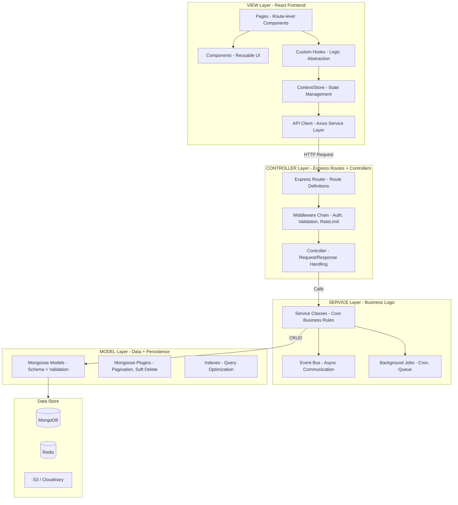

### 1.0.1 MVC Request Lifecycle (Chi tiet)

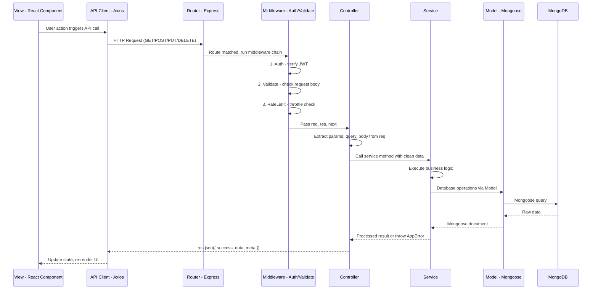

### 1.0.2 Vai tro cua tung tang trong MVC

**MODEL (Mongoose Models)** -- Chiu trach nhiem duy nhat ve data:
- Dinh nghia schema, validation rules, indexes
- Mongoose hooks (pre-save, post-save)
- Static methods (findByEmail, findPublicSets)
- Instance methods (comparePassword, toJSON)
- Virtual fields (fullName, isExpired)
- KHONG chua business logic phuc tap

**VIEW (React Frontend)** -- Chiu trach nhiem duy nhat ve presentation:
- Render UI dua tren state
- Capture user input va events
- Goi API thong qua API Client layer
- State management (Context + useReducer)
- KHONG goi truc tiep database hay business logic

**CONTROLLER (Express Controllers)** -- Chiu trach nhiem duy nhat ve request/response:
- Nhan HTTP request, extract data
- Goi Service layer xu ly business logic
- Format response tra ve client
- Handle HTTP status codes
- KHONG chua business logic, KHONG goi Model truc tiep

**SERVICE (Business Logic Layer)** -- Tang bo sung cho MVC thuan:
- Chua toan bo business logic
- Goi Model de thao tac data
- Xu ly validation nghiep vu (khong phai input validation)
- Emit events (study.completed, xp.earned)
- Co the goi nhieu Models trong 1 operation
- KHONG biet ve HTTP request/response

### 1.0.3 Code Examples cho tung tang MVC

**Model Layer** -- `user.model.js`:
```javascript
const userSchema = new Schema({
  email: { type: String, required: true, unique: true, lowercase: true },
  username: { type: String, required: true, unique: true },
  passwordHash: { type: String, required: true, select: false },
  role: { type: String, enum: ['student', 'premium', 'admin'], default: 'student' },
  profile: { firstName: String, lastName: String },
}, { timestamps: true });

userSchema.virtual('fullName').get(function () {
  return `${this.profile.firstName} ${this.profile.lastName}`;
});

userSchema.pre('save', async function (next) {
  if (!this.isModified('passwordHash')) return next();
  this.passwordHash = await bcrypt.hash(this.passwordHash, 12);
  next();
});

userSchema.methods.comparePassword = async function (candidatePassword) {
  return bcrypt.compare(candidatePassword, this.passwordHash);
};

userSchema.statics.findByEmail = function (email) {
  return this.findOne({ email }).select('+passwordHash');
};

module.exports = mongoose.model('User', userSchema);
```

**Controller Layer** -- `auth.controller.js`:
```javascript
const authService = require('./auth.service');
const { asyncHandler } = require('../../shared/utils/asyncHandler');
const { ApiResponse } = require('../../shared/utils/apiResponse');

class AuthController {
  register = asyncHandler(async (req, res) => {
    const { email, username, password } = req.body;
    const { user, accessToken, refreshToken } = await authService.register({ email, username, password });
    res.status(201).json(ApiResponse.success({ user, accessToken, refreshToken }, 'Registration successful'));
  });

  login = asyncHandler(async (req, res) => {
    const { email, password } = req.body;
    const { user, accessToken, refreshToken } = await authService.login(email, password);
    res.status(200).json(ApiResponse.success({ user, accessToken, refreshToken }));
  });

  refreshToken = asyncHandler(async (req, res) => {
    const { refreshToken } = req.body;
    const tokens = await authService.refreshToken(refreshToken);
    res.status(200).json(ApiResponse.success(tokens));
  });
}

module.exports = new AuthController();
```

**Service Layer** -- `auth.service.js`:
```javascript
const User = require('../user/user.model');
const GamificationProfile = require('../gamification/models/gamificationProfile.model');
const { generateAccessToken, generateRefreshToken, verifyRefreshToken } = require('../../shared/utils/jwt');
const { AppError } = require('../../shared/errors/AppError');
const redisClient = require('../../config/redis');
const eventBus = require('../../shared/events/eventBus');

class AuthService {
  async register({ email, username, password }) {
    const existingUser = await User.findOne({ $or: [{ email }, { username }] });
    if (existingUser) throw new AppError('Email or username already exists', 409);

    const user = await User.create({ email, username, passwordHash: password });
    await GamificationProfile.create({ user: user._id });

    const accessToken = generateAccessToken(user);
    const refreshToken = generateRefreshToken(user);
    await redisClient.set(`refresh:${user._id}`, refreshToken, 'EX', 7 * 24 * 3600);

    eventBus.emit('user.registered', { userId: user._id, email: user.email });

    return { user: user.toJSON(), accessToken, refreshToken };
  }

  async login(email, password) {
    const user = await User.findByEmail(email);
    if (!user || !(await user.comparePassword(password))) {
      throw new AppError('Invalid email or password', 401);
    }

    user.lastLoginAt = new Date();
    await user.save();

    const accessToken = generateAccessToken(user);
    const refreshToken = generateRefreshToken(user);
    await redisClient.set(`refresh:${user._id}`, refreshToken, 'EX', 7 * 24 * 3600);

    return { user: user.toJSON(), accessToken, refreshToken };
  }

  async refreshToken(token) {
    const decoded = verifyRefreshToken(token);
    const storedToken = await redisClient.get(`refresh:${decoded.sub}`);
    if (storedToken !== token) throw new AppError('Invalid refresh token', 401);

    const user = await User.findById(decoded.sub);
    if (!user) throw new AppError('User not found', 404);

    const accessToken = generateAccessToken(user);
    const newRefreshToken = generateRefreshToken(user);
    await redisClient.set(`refresh:${user._id}`, newRefreshToken, 'EX', 7 * 24 * 3600);

    return { accessToken, refreshToken: newRefreshToken };
  }
}

module.exports = new AuthService();
```

**Routes Layer** -- `auth.routes.js`:
```javascript
const router = require('express').Router();
const authController = require('./auth.controller');
const { validate } = require('../../middleware/validation.middleware');
const { registerSchema, loginSchema } = require('./auth.validation');
const { rateLimiter } = require('../../middleware/rateLimiter.middleware');

router.post('/register', validate(registerSchema), authController.register);
router.post('/login', rateLimiter(5, 15), validate(loginSchema), authController.login);
router.post('/refresh', authController.refreshToken);
router.post('/logout', authController.logout);

module.exports = router;
```

**Validation Layer** -- `auth.validation.js`:
```javascript
const Joi = require('joi');

const registerSchema = Joi.object({
  email: Joi.string().email().required(),
  username: Joi.string().alphanum().min(3).max(30).required(),
  password: Joi.string().min(8).pattern(/^(?=.*[a-z])(?=.*[A-Z])(?=.*\d)/).required()
    .messages({ 'string.pattern.base': 'Password must contain uppercase, lowercase and number' }),
});

const loginSchema = Joi.object({
  email: Joi.string().email().required(),
  password: Joi.string().required(),
});

module.exports = { registerSchema, loginSchema };
```

**View Layer (React)** -- `useAuth.js` hook + `LoginForm` component:
```javascript
// hooks/useAuth.js
const useAuth = () => {
  const { state, dispatch } = useContext(AuthContext);

  const login = async (email, password) => {
    dispatch({ type: 'LOGIN_START' });
    try {
      const { data } = await authAPI.login({ email, password });
      localStorage.setItem('accessToken', data.accessToken);
      localStorage.setItem('refreshToken', data.refreshToken);
      dispatch({ type: 'LOGIN_SUCCESS', payload: data.user });
    } catch (error) {
      dispatch({ type: 'LOGIN_FAILURE', payload: error.response?.data?.error?.message });
      throw error;
    }
  };

  return { user: state.user, loading: state.loading, error: state.error, login, logout, register };
};

// components/auth/LoginForm/LoginForm.jsx
const LoginForm = () => {
  const [formData, setFormData] = useState({ email: '', password: '' });
  const { login, loading, error } = useAuth();
  const navigate = useNavigate();

  const handleSubmit = async (e) => {
    e.preventDefault();
    try {
      await login(formData.email, formData.password);
      navigate('/dashboard');
    } catch (err) { /* error already in state */ }
  };

  return (
    <form onSubmit={handleSubmit}>
      <input className="form-control" type="email" value={formData.email}
        onChange={e => setFormData({...formData, email: e.target.value})} />
      <input className="form-control" type="password" value={formData.password}
        onChange={e => setFormData({...formData, password: e.target.value})} />
      {error && <div className="alert alert-danger">{error}</div>}
      <button className="btn btn-primary" disabled={loading}>
        {loading ? 'Logging in...' : 'Login'}
      </button>
    </form>
  );
};
```

### 1.0.4 BaseService Pattern

Tat ca Services ke thua tu `BaseService` de co CRUD chung, giam code lap lai:

```javascript
// shared/services/BaseService.js
const { AppError } = require('../errors/AppError');

class BaseService {
  constructor(model) {
    this.model = model;
  }

  async findAll(filter = {}, options = {}) {
    const { page = 1, limit = 20, sort = '-createdAt', populate = '' } = options;
    const skip = (page - 1) * limit;

    const [data, total] = await Promise.all([
      this.model.find(filter).sort(sort).skip(skip).limit(limit).populate(populate),
      this.model.countDocuments(filter),
    ]);

    return {
      data,
      meta: { page, limit, total, totalPages: Math.ceil(total / limit) },
    };
  }

  async findById(id, populate = '') {
    const doc = await this.model.findById(id).populate(populate);
    if (!doc) throw new AppError(`${this.model.modelName} not found`, 404);
    return doc;
  }

  async create(data) {
    return this.model.create(data);
  }

  async update(id, data) {
    const doc = await this.model.findByIdAndUpdate(id, data, { new: true, runValidators: true });
    if (!doc) throw new AppError(`${this.model.modelName} not found`, 404);
    return doc;
  }

  async delete(id) {
    const doc = await this.model.findByIdAndDelete(id);
    if (!doc) throw new AppError(`${this.model.modelName} not found`, 404);
    return doc;
  }
}

module.exports = BaseService;
```

### 1.0.5 Event Bus Pattern

Services giao tiep voi nhau qua EventBus, khong import truc tiep -- chuan bi san cho microservices sau nay:

```javascript
// shared/events/eventBus.js
const EventEmitter = require('events');

class EventBus extends EventEmitter {
  emit(event, data) {
    console.log(`[Event] ${event}`, JSON.stringify(data).slice(0, 200));
    super.emit(event, data);
  }
}

const eventBus = new EventBus();
eventBus.setMaxListeners(20);
module.exports = eventBus;
```

```javascript
// shared/events/eventHandlers.js
const eventBus = require('./eventBus');

module.exports = function registerEventHandlers({ gamificationService, notificationService, streakService }) {

  eventBus.on('user.registered', async ({ userId, email }) => {
    await notificationService.sendWelcomeEmail(userId, email);
  });

  eventBus.on('study.completed', async ({ userId, xpEarned, mode, accuracy }) => {
    await gamificationService.awardXP(userId, xpEarned, `${mode}_completed`);
    await streakService.recordActivity(userId);
    await gamificationService.checkAndUnlockAchievements(userId);
    await gamificationService.updateDailyQuests(userId, { type: 'earn_xp', progress: xpEarned });
  });

  eventBus.on('xp.earned', async ({ userId, amount, newTotal }) => {
    await gamificationService.updateLeaderboard(userId, newTotal);
    await gamificationService.checkLevelUp(userId, newTotal);
  });

  eventBus.on('achievement.unlocked', async ({ userId, achievement }) => {
    await notificationService.create({
      user: userId,
      type: 'achievement',
      title: `Achievement Unlocked: ${achievement.title}`,
      body: achievement.description,
    });
  });

  eventBus.on('flashcard.reviewed', async ({ userId, cardId, quality }) => {
    // SM-2 schedule duoc xu ly trong StudyService, event nay chi de log/analytics
  });

  eventBus.on('lesson.completed', async ({ userId, lessonId, xpReward, accuracy }) => {
    await gamificationService.awardXP(userId, xpReward, 'lesson_completed');
    if (accuracy === 1) {
      await gamificationService.awardXP(userId, 5, 'perfect_score_bonus');
    }
    await gamificationService.updateDailyQuests(userId, { type: 'complete_lessons', progress: 1 });
  });
};
```

### 1.0.6 Service Implementations Chi Tiet

#### A. FlashcardService -- Quizlet Core

```javascript
// modules/flashcard/flashcard.service.js
const BaseService = require('../../shared/services/BaseService');
const FlashcardSet = require('./models/flashcardSet.model');
const Flashcard = require('./models/flashcard.model');
const UserProgress = require('../study/userProgress.model');
const { AppError } = require('../../shared/errors/AppError');
const redisClient = require('../../config/redis');

class FlashcardService extends BaseService {
  constructor() {
    super(FlashcardSet);
  }

  // --- Set Management ---

  async createSet(userId, data) {
    const set = await FlashcardSet.create({
      ...data,
      creator: userId,
    });
    return set;
  }

  async getSetWithCards(setId, userId) {
    const cacheKey = `set:${setId}`;
    const cached = await redisClient.get(cacheKey);
    if (cached) return JSON.parse(cached);

    const set = await FlashcardSet.findById(setId).populate('creator', 'username avatar');
    if (!set) throw new AppError('Flashcard set not found', 404);

    if (set.visibility === 'private' && set.creator._id.toString() !== userId) {
      throw new AppError('You do not have access to this set', 403);
    }

    const cards = await Flashcard.find({ set: setId }).sort('order');
    const result = { set, cards };

    await redisClient.setex(cacheKey, 3600, JSON.stringify(result));
    return result;
  }

  async updateSet(setId, userId, data) {
    const set = await FlashcardSet.findById(setId);
    if (!set) throw new AppError('Set not found', 404);

    const isOwner = set.creator.toString() === userId;
    const isEditor = set.collaborators.some(c => c.user.toString() === userId && c.role === 'editor');
    if (!isOwner && !isEditor) throw new AppError('Not authorized', 403);

    Object.assign(set, data);
    await set.save();

    await redisClient.del(`set:${setId}`);
    return set;
  }

  async deleteSet(setId, userId) {
    const set = await FlashcardSet.findById(setId);
    if (!set) throw new AppError('Set not found', 404);
    if (set.creator.toString() !== userId) throw new AppError('Only owner can delete', 403);

    await Flashcard.deleteMany({ set: setId });
    await set.deleteOne();
    await redisClient.del(`set:${setId}`);
  }

  // --- Card Management ---

  async addCard(setId, userId, cardData) {
    const set = await this._authorizeSetAccess(setId, userId);
    const maxOrder = await Flashcard.findOne({ set: setId }).sort('-order');
    const card = await Flashcard.create({
      ...cardData,
      set: setId,
      order: (maxOrder?.order ?? -1) + 1,
    });

    set.cardCount += 1;
    await set.save();
    await redisClient.del(`set:${setId}`);
    return card;
  }

  async bulkUpdateCards(setId, userId, cards) {
    await this._authorizeSetAccess(setId, userId);

    const bulkOps = cards.map(card => ({
      updateOne: {
        filter: { _id: card.id, set: setId },
        update: { $set: { 'front.text': card.front, 'back.text': card.back, order: card.order } },
      },
    }));

    await Flashcard.bulkWrite(bulkOps);
    await redisClient.del(`set:${setId}`);
  }

  async reorderCards(setId, userId, cardIds) {
    await this._authorizeSetAccess(setId, userId);
    const bulkOps = cardIds.map((id, index) => ({
      updateOne: { filter: { _id: id, set: setId }, update: { $set: { order: index } } },
    }));
    await Flashcard.bulkWrite(bulkOps);
    await redisClient.del(`set:${setId}`);
  }

  // --- Search & Browse ---

  async searchPublicSets({ query, tags, sort = 'popular', page = 1, limit = 20 }) {
    const filter = { visibility: 'public' };
    if (query) filter.$text = { $search: query };
    if (tags?.length) filter.tags = { $in: tags };

    const sortMap = {
      popular: '-studyCount',
      recent: '-createdAt',
      rating: '-rating',
    };

    return this.findAll(filter, {
      page, limit,
      sort: sortMap[sort] || '-studyCount',
      populate: 'creator:username,avatar',
    });
  }

  // --- Share & Collaborate ---

  async duplicateSet(setId, userId) {
    const { set, cards } = await this.getSetWithCards(setId, userId);

    const newSet = await FlashcardSet.create({
      title: `${set.title} (Copy)`,
      description: set.description,
      creator: userId,
      visibility: 'private',
      tags: set.tags,
      language: set.language,
    });

    const newCards = cards.map(card => ({
      set: newSet._id,
      front: card.front,
      back: card.back,
      order: card.order,
    }));
    await Flashcard.insertMany(newCards);

    newSet.cardCount = newCards.length;
    await newSet.save();
    return newSet;
  }

  async addCollaborator(setId, ownerId, targetUserId, role = 'viewer') {
    const set = await FlashcardSet.findById(setId);
    if (!set) throw new AppError('Set not found', 404);
    if (set.creator.toString() !== ownerId) throw new AppError('Only owner can manage collaborators', 403);

    const exists = set.collaborators.find(c => c.user.toString() === targetUserId);
    if (exists) {
      exists.role = role;
    } else {
      set.collaborators.push({ user: targetUserId, role });
    }
    await set.save();
    return set;
  }

  // --- Bookmark ---

  async toggleBookmark(setId, userId) {
    const progress = await UserProgress.findOne({ user: userId });
    const isBookmarked = progress?.favoriteSets?.includes(setId);

    if (isBookmarked) {
      await UserProgress.updateOne({ user: userId }, { $pull: { favoriteSets: setId } });
    } else {
      await UserProgress.updateOne({ user: userId }, { $addToSet: { favoriteSets: setId } }, { upsert: true });
    }
    return { bookmarked: !isBookmarked };
  }

  // --- Private helpers ---

  async _authorizeSetAccess(setId, userId) {
    const set = await FlashcardSet.findById(setId);
    if (!set) throw new AppError('Set not found', 404);
    const isOwner = set.creator.toString() === userId;
    const isEditor = set.collaborators.some(c => c.user.toString() === userId && c.role === 'editor');
    if (!isOwner && !isEditor) throw new AppError('Not authorized to edit this set', 403);
    return set;
  }
}

module.exports = new FlashcardService();
```

#### B. ImportService -- File Import

```javascript
// modules/flashcard/import.service.js
const xlsx = require('xlsx');
const csvParser = require('csv-parser');
const { Readable } = require('stream');
const Flashcard = require('./models/flashcard.model');
const FlashcardSet = require('./models/flashcardSet.model');
const { AppError } = require('../../shared/errors/AppError');

class ImportService {
  async importFromFile(userId, file, setData) {
    const ext = file.originalname.split('.').pop().toLowerCase();

    let rows;
    if (ext === 'csv') {
      rows = await this._parseCSV(file.buffer);
    } else if (['xlsx', 'xls'].includes(ext)) {
      rows = this._parseExcel(file.buffer);
    } else {
      throw new AppError('Unsupported file format. Use CSV or Excel.', 400);
    }

    if (!rows.length) throw new AppError('File is empty', 400);
    if (rows.length > 500) throw new AppError('Maximum 500 cards per import', 400);

    const set = await FlashcardSet.create({
      title: setData.title || file.originalname.replace(/\.[^.]+$/, ''),
      description: setData.description || `Imported from ${file.originalname}`,
      creator: userId,
      visibility: 'private',
    });

    const cards = rows.map((row, index) => ({
      set: set._id,
      front: { text: row.front || row.term || row.word || '' },
      back: {
        text: row.back || row.definition || row.meaning || '',
        example: row.example || '',
        pronunciation: row.pronunciation || '',
      },
      order: index,
    })).filter(card => card.front.text && card.back.text);

    await Flashcard.insertMany(cards);
    set.cardCount = cards.length;
    await set.save();

    return { set, importedCount: cards.length, skippedCount: rows.length - cards.length };
  }

  _parseExcel(buffer) {
    const workbook = xlsx.read(buffer, { type: 'buffer' });
    const sheet = workbook.Sheets[workbook.SheetNames[0]];
    return xlsx.utils.sheet_to_json(sheet);
  }

  async _parseCSV(buffer) {
    return new Promise((resolve, reject) => {
      const rows = [];
      Readable.from(buffer)
        .pipe(csvParser())
        .on('data', row => rows.push(row))
        .on('end', () => resolve(rows))
        .on('error', reject);
    });
  }
}

module.exports = new ImportService();
```

#### C. StudyService -- Study Session Management

```javascript
// modules/study/study.service.js
const StudySession = require('./study.model');
const Flashcard = require('../flashcard/models/flashcard.model');
const { AppError } = require('../../shared/errors/AppError');
const eventBus = require('../../shared/events/eventBus');
const spacedRepetitionService = require('./spacedRepetition.service');

class StudyService {
  async startSession(userId, { setId, lessonId, type, mode }) {
    const session = await StudySession.create({
      user: userId,
      set: setId || undefined,
      lesson: lessonId || undefined,
      type,
      mode,
      startedAt: new Date(),
    });
    return session;
  }

  async submitAnswer(sessionId, userId, { cardId, exerciseId, userAnswer, correct, timeSpent }) {
    const session = await StudySession.findOne({ _id: sessionId, user: userId });
    if (!session) throw new AppError('Session not found', 404);
    if (session.completedAt) throw new AppError('Session already completed', 400);

    session.reviews.push({
      card: cardId || undefined,
      exercise: exerciseId || undefined,
      userAnswer,
      correct,
      timeSpent,
    });

    session.results.total += 1;
    if (correct) session.results.correct += 1;
    else session.results.incorrect += 1;

    await session.save();

    if (cardId) {
      const quality = correct ? (timeSpent < 5000 ? 5 : 3) : 1;
      await spacedRepetitionService.updateCardSchedule(userId, cardId, quality);
      eventBus.emit('flashcard.reviewed', { userId, cardId, quality });
    }

    return { correct, reviewCount: session.results.total };
  }

  async completeSession(sessionId, userId) {
    const session = await StudySession.findOne({ _id: sessionId, user: userId });
    if (!session) throw new AppError('Session not found', 404);
    if (session.completedAt) throw new AppError('Already completed', 400);

    session.completedAt = new Date();
    session.duration = Math.round((session.completedAt - session.startedAt) / 1000);
    session.results.accuracy = session.results.total > 0
      ? Math.round((session.results.correct / session.results.total) * 100) / 100
      : 0;

    const xpEarned = this._calculateXP(session);
    session.xpEarned = xpEarned;
    await session.save();

    eventBus.emit('study.completed', {
      userId,
      sessionId: session._id,
      xpEarned,
      mode: session.mode,
      type: session.type,
      accuracy: session.results.accuracy,
      duration: session.duration,
    });

    return session;
  }

  async getStudyHistory(userId, { page = 1, limit = 20, mode }) {
    const filter = { user: userId, completedAt: { $ne: null } };
    if (mode) filter.mode = mode;

    const sessions = await StudySession.find(filter)
      .sort('-completedAt')
      .skip((page - 1) * limit)
      .limit(limit)
      .populate('set', 'title')
      .populate('lesson', 'title');

    const total = await StudySession.countDocuments(filter);
    return { data: sessions, meta: { page, limit, total, totalPages: Math.ceil(total / limit) } };
  }

  _calculateXP(session) {
    let xp = 0;
    const { type, results } = session;

    const xpRules = { flashcard: 10, learn: 15, test: 20, write: 15, match: 10, lesson: 15 };
    xp += xpRules[type] || 10;

    if (results.accuracy >= 1.0) xp += 5;
    else if (results.accuracy >= 0.8) xp += 2;

    if (results.total >= 20) xp += 5;

    return xp;
  }
}

module.exports = new StudyService();
```

#### D. SpacedRepetitionService -- SM-2 Algorithm

```javascript
// modules/study/spacedRepetition.service.js
const UserProgress = require('./userProgress.model');

class SpacedRepetitionService {
  async updateCardSchedule(userId, cardId, quality) {
    let progress = await UserProgress.findOne({ user: userId });
    if (!progress) {
      progress = await UserProgress.create({ user: userId });
    }

    let cardProgress = progress.flashcardProgress.find(
      fp => fp.card.toString() === cardId
    );

    if (!cardProgress) {
      progress.flashcardProgress.push({
        card: cardId,
        status: 'learning',
        easeFactor: 2.5,
        interval: 0,
        repetitions: 0,
      });
      cardProgress = progress.flashcardProgress[progress.flashcardProgress.length - 1];
    }

    const updated = this._sm2Algorithm(cardProgress, quality);
    cardProgress.easeFactor = updated.easeFactor;
    cardProgress.interval = updated.interval;
    cardProgress.repetitions = updated.repetitions;
    cardProgress.nextReviewAt = updated.nextReviewAt;
    cardProgress.lastReviewedAt = new Date();
    cardProgress.status = this._getStatus(updated);

    await progress.save();
    return cardProgress;
  }

  async getDueCards(userId, limit = 20) {
    const progress = await UserProgress.findOne({ user: userId });
    if (!progress) return [];

    const now = new Date();
    const dueCards = progress.flashcardProgress
      .filter(fp => !fp.nextReviewAt || fp.nextReviewAt <= now)
      .sort((a, b) => (a.nextReviewAt || 0) - (b.nextReviewAt || 0))
      .slice(0, limit);

    return UserProgress.populate(dueCards, { path: 'card' });
  }

  _sm2Algorithm(card, quality) {
    // quality: 0 = complete fail, 1 = wrong, 2 = hard, 3 = good, 4 = easy, 5 = perfect
    let { easeFactor, interval, repetitions } = card;

    if (quality >= 3) {
      if (repetitions === 0) interval = 1;
      else if (repetitions === 1) interval = 6;
      else interval = Math.round(interval * easeFactor);
      repetitions++;
    } else {
      repetitions = 0;
      interval = 1;
    }

    easeFactor = Math.max(1.3,
      easeFactor + (0.1 - (5 - quality) * (0.08 + (5 - quality) * 0.02))
    );

    const nextReviewAt = new Date();
    nextReviewAt.setDate(nextReviewAt.getDate() + interval);

    return { easeFactor, interval, repetitions, nextReviewAt };
  }

  _getStatus({ repetitions, interval }) {
    if (repetitions === 0) return 'learning';
    if (interval >= 21) return 'mastered';
    if (interval >= 7) return 'known';
    return 'learning';
  }
}

module.exports = new SpacedRepetitionService();
```

#### E. GamificationService -- XP, Streak, Level, Leaderboard, Achievement, DailyQuest

```javascript
// modules/gamification/gamification.service.js
const GamificationProfile = require('./models/gamificationProfile.model');
const Achievement = require('./models/achievement.model');
const { AppError } = require('../../shared/errors/AppError');
const eventBus = require('../../shared/events/eventBus');
const redisClient = require('../../config/redis');

class GamificationService {
  // --- XP ---

  async awardXP(userId, amount, source) {
    const profile = await GamificationProfile.findOne({ user: userId });
    if (!profile) throw new AppError('Gamification profile not found', 404);

    profile.xp.total += amount;
    profile.xp.weekly += amount;
    profile.xp.daily += amount;
    await profile.save();

    eventBus.emit('xp.earned', { userId, amount, source, newTotal: profile.xp.total });

    return { xpEarned: amount, totalXP: profile.xp.total, level: profile.level };
  }

  // --- Level ---

  async checkLevelUp(userId, totalXP) {
    const profile = await GamificationProfile.findOne({ user: userId });
    const newLevel = this._calculateLevel(totalXP);

    if (newLevel > profile.level) {
      profile.level = newLevel;
      await profile.save();
      eventBus.emit('achievement.unlocked', {
        userId,
        achievement: { title: `Level ${newLevel}!`, description: `You reached level ${newLevel}` },
      });
    }
  }

  _calculateLevel(xp) {
    // Level N requires N*(N-1)*50 XP
    let level = 1;
    while (level * (level - 1) * 50 <= xp) level++;
    return level - 1;
  }

  // --- Leaderboard (Redis Sorted Set) ---

  async updateLeaderboard(userId, weeklyXP) {
    const weekKey = this._getWeekKey();
    await redisClient.zadd(`leaderboard:${weekKey}`, weeklyXP, userId);
  }

  async getLeaderboard(league = null, page = 1, limit = 50) {
    const weekKey = this._getWeekKey();
    let key = `leaderboard:${weekKey}`;
    if (league) key = `leaderboard:${weekKey}:${league}`;

    const start = (page - 1) * limit;
    const end = start + limit - 1;

    const results = await redisClient.zrevrange(key, start, end, 'WITHSCORES');

    const entries = [];
    for (let i = 0; i < results.length; i += 2) {
      entries.push({ userId: results[i], xp: parseInt(results[i + 1]), rank: start + i / 2 + 1 });
    }
    return entries;
  }

  _getWeekKey() {
    const now = new Date();
    const year = now.getFullYear();
    const week = Math.ceil(((now - new Date(year, 0, 1)) / 86400000 + 1) / 7);
    return `${year}-W${week}`;
  }

  // --- Achievement ---

  async checkAndUnlockAchievements(userId) {
    const profile = await GamificationProfile.findOne({ user: userId });
    const allAchievements = await Achievement.find();
    const unlockedIds = profile.achievements.map(a => a.achievement.toString());
    const newUnlocks = [];

    for (const achievement of allAchievements) {
      if (unlockedIds.includes(achievement._id.toString())) continue;

      const earned = this._evaluateCriteria(achievement.criteria, profile);
      if (earned) {
        profile.achievements.push({ achievement: achievement._id });
        if (achievement.xpReward > 0) {
          profile.xp.total += achievement.xpReward;
          profile.xp.daily += achievement.xpReward;
        }
        newUnlocks.push(achievement);
        eventBus.emit('achievement.unlocked', { userId, achievement });
      }
    }

    if (newUnlocks.length) await profile.save();
    return newUnlocks;
  }

  _evaluateCriteria(criteria, profile) {
    const { type, threshold } = criteria;
    switch (type) {
      case 'streak': return profile.streak.current >= threshold;
      case 'total_xp': return profile.xp.total >= threshold;
      case 'cards_studied': return profile.stats.totalCardsStudied >= threshold;
      case 'perfect_scores': return profile.stats.totalPerfectScores >= threshold;
      case 'sets_created': return profile.stats.totalSetsCreated >= threshold;
      case 'lessons_completed': return profile.stats.totalLessonsCompleted >= threshold;
      default: return false;
    }
  }

  // --- Daily Quests ---

  async generateDailyQuests(userId) {
    const profile = await GamificationProfile.findOne({ user: userId });
    const today = new Date();
    today.setHours(0, 0, 0, 0);

    const hasQuestsToday = profile.dailyQuests.some(
      q => q.date && new Date(q.date).toDateString() === today.toDateString()
    );
    if (hasQuestsToday) return profile.dailyQuests.filter(
      q => q.date && new Date(q.date).toDateString() === today.toDateString()
    );

    const questPool = [
      { type: 'earn_xp', target: 50, xpReward: 10 },
      { type: 'earn_xp', target: 100, xpReward: 25 },
      { type: 'complete_lessons', target: 3, xpReward: 20 },
      { type: 'study_cards', target: 20, xpReward: 15 },
      { type: 'study_cards', target: 50, xpReward: 30 },
      { type: 'perfect_score', target: 1, xpReward: 25 },
    ];

    const shuffled = questPool.sort(() => Math.random() - 0.5);
    const selected = shuffled.slice(0, 3).map(q => ({ ...q, progress: 0, completed: false, date: today }));

    profile.dailyQuests.push(...selected);
    await profile.save();
    return selected;
  }

  async updateDailyQuests(userId, { type, progress }) {
    const profile = await GamificationProfile.findOne({ user: userId });
    const today = new Date().toDateString();

    for (const quest of profile.dailyQuests) {
      if (quest.completed) continue;
      if (quest.date && new Date(quest.date).toDateString() !== today) continue;
      if (quest.type !== type) continue;

      quest.progress += progress;
      if (quest.progress >= quest.target) {
        quest.completed = true;
        await this.awardXP(userId, quest.xpReward, 'daily_quest');
      }
    }
    await profile.save();
  }
}

module.exports = new GamificationService();
```

#### F. StreakService

```javascript
// modules/gamification/streak.service.js
const GamificationProfile = require('./models/gamificationProfile.model');

class StreakService {
  async recordActivity(userId) {
    const profile = await GamificationProfile.findOne({ user: userId });
    if (!profile) return;

    const today = new Date();
    today.setHours(0, 0, 0, 0);
    const lastActivity = profile.streak.lastActivityDate
      ? new Date(profile.streak.lastActivityDate)
      : null;

    if (lastActivity) {
      lastActivity.setHours(0, 0, 0, 0);
      const diffDays = Math.floor((today - lastActivity) / (1000 * 60 * 60 * 24));

      if (diffDays === 0) return; // da hoc hom nay roi
      if (diffDays === 1) {
        profile.streak.current += 1;
      } else {
        profile.streak.current = 1; // mat streak
      }
    } else {
      profile.streak.current = 1;
    }

    if (profile.streak.current > profile.streak.longest) {
      profile.streak.longest = profile.streak.current;
    }
    profile.streak.lastActivityDate = today;
    await profile.save();
  }

  async useStreakFreeze(userId) {
    const profile = await GamificationProfile.findOne({ user: userId });
    if (profile.streak.freezesAvailable <= 0) {
      throw new AppError('No streak freezes available', 400);
    }
    profile.streak.freezesAvailable -= 1;
    profile.streak.freezeUsedToday = true;
    await profile.save();
    return { freezesRemaining: profile.streak.freezesAvailable };
  }

  // Chay moi ngay luc 00:05 UTC qua cron job
  async checkDailyStreaks() {
    const yesterday = new Date();
    yesterday.setDate(yesterday.getDate() - 1);
    yesterday.setHours(0, 0, 0, 0);

    const atRisk = await GamificationProfile.find({
      'streak.current': { $gt: 0 },
      'streak.lastActivityDate': { $lt: yesterday },
      'streak.freezeUsedToday': false,
    });

    for (const profile of atRisk) {
      if (profile.streak.freezesAvailable > 0) {
        profile.streak.freezesAvailable -= 1;
        profile.streak.freezeUsedToday = true;
      } else {
        profile.streak.current = 0;
      }
      await profile.save();
    }

    // Reset freezeUsedToday cho tat ca
    await GamificationProfile.updateMany({}, { $set: { 'streak.freezeUsedToday': false } });
  }
}

module.exports = new StreakService();
```

#### G. DuolingoService -- Course, Lesson, Exercise

```javascript
// modules/duolingo/duolingo.service.js
const Course = require('./models/course.model');
const Unit = require('./models/unit.model');
const Lesson = require('./models/lesson.model');
const Exercise = require('./models/exercise.model');
const UserProgress = require('../study/userProgress.model');
const { AppError } = require('../../shared/errors/AppError');
const eventBus = require('../../shared/events/eventBus');

class DuolingoService {
  async enrollCourse(userId, courseId) {
    const course = await Course.findById(courseId);
    if (!course) throw new AppError('Course not found', 404);

    const existing = await UserProgress.findOne({ user: userId, course: courseId });
    if (existing) throw new AppError('Already enrolled', 400);

    const firstUnit = await Unit.findOne({ course: courseId }).sort('order');

    await UserProgress.create({
      user: userId,
      course: courseId,
      currentUnit: firstUnit?._id,
      completedLessons: [],
      lessonScores: [],
    });

    course.enrollCount += 1;
    await course.save();
    return { enrolled: true, courseId };
  }

  async getCourseProgress(userId, courseId) {
    const progress = await UserProgress.findOne({ user: userId, course: courseId });
    if (!progress) throw new AppError('Not enrolled in this course', 404);

    const units = await Unit.find({ course: courseId }).sort('order');
    const lessons = await Lesson.find({ unit: { $in: units.map(u => u._id) } }).sort('order');

    const unitProgress = units.map(unit => {
      const unitLessons = lessons.filter(l => l.unit.toString() === unit._id.toString());
      const completedInUnit = unitLessons.filter(l =>
        progress.completedLessons.some(cl => cl.toString() === l._id.toString())
      );
      const isUnlocked = this._isUnitUnlocked(unit, units, progress);

      return {
        unit,
        lessons: unitLessons.map(l => ({
          ...l.toObject(),
          completed: progress.completedLessons.some(cl => cl.toString() === l._id.toString()),
          bestScore: progress.lessonScores.find(ls => ls.lesson.toString() === l._id.toString())?.bestScore,
          crowns: progress.lessonScores.find(ls => ls.lesson.toString() === l._id.toString())?.crowns || 0,
        })),
        isUnlocked,
        completedCount: completedInUnit.length,
        totalCount: unitLessons.length,
      };
    });

    return { courseId, unitProgress };
  }

  async startLesson(userId, lessonId) {
    const lesson = await Lesson.findById(lessonId).populate('unit');
    if (!lesson) throw new AppError('Lesson not found', 404);

    const progress = await UserProgress.findOne({ user: userId, course: lesson.unit.course });
    if (!progress) throw new AppError('Not enrolled', 404);

    const exercises = await Exercise.find({ lesson: lessonId }).sort('order');
    return { lesson, exercises };
  }

  async completeLesson(userId, lessonId, { score, accuracy }) {
    const lesson = await Lesson.findById(lessonId).populate('unit');
    if (!lesson) throw new AppError('Lesson not found', 404);

    const progress = await UserProgress.findOne({ user: userId, course: lesson.unit.course });

    if (!progress.completedLessons.includes(lessonId)) {
      progress.completedLessons.push(lessonId);
    }

    const existingScore = progress.lessonScores.find(ls => ls.lesson.toString() === lessonId);
    if (existingScore) {
      existingScore.attempts += 1;
      existingScore.lastAttemptAt = new Date();
      if (score > existingScore.bestScore) existingScore.bestScore = score;
      if (accuracy >= 1.0 && existingScore.crowns < 5) existingScore.crowns += 1;
    } else {
      progress.lessonScores.push({
        lesson: lessonId,
        bestScore: score,
        attempts: 1,
        lastAttemptAt: new Date(),
        crowns: accuracy >= 1.0 ? 1 : 0,
      });
    }

    await progress.save();

    eventBus.emit('lesson.completed', {
      userId,
      lessonId,
      xpReward: lesson.xpReward,
      accuracy,
    });

    return { xpEarned: lesson.xpReward, crowns: existingScore?.crowns || (accuracy >= 1.0 ? 1 : 0) };
  }

  _isUnitUnlocked(unit, allUnits, progress) {
    if (unit.order === 0) return true;
    if (unit.unlockCriteria?.type === 'none') return true;

    const prevUnit = allUnits.find(u => u.order === unit.order - 1);
    if (!prevUnit) return true;

    // Check: tat ca lessons cua unit truoc da hoan thanh chua
    // (simplified -- trong thuc te can query lessons)
    return progress.completedLessons.length > 0;
  }
}

module.exports = new DuolingoService();
```

#### H. ExerciseService -- Exercise Validation + Scoring

```javascript
// modules/duolingo/exercise.service.js
const { AppError } = require('../../shared/errors/AppError');

class ExerciseService {
  validateAnswer(exercise, userAnswer) {
    const handler = this._getHandler(exercise.type);
    return handler(exercise, userAnswer);
  }

  _getHandler(type) {
    const handlers = {
      multiple_choice: this._validateMultipleChoice,
      true_false: this._validateTrueFalse,
      fill_blank: this._validateFillBlank,
      typing: this._validateTyping,
      matching: this._validateMatching,
      word_bank: this._validateWordBank,
      translation: this._validateTranslation,
      reorder_sentence: this._validateReorder,
    };
    const handler = handlers[type];
    if (!handler) throw new AppError(`Unknown exercise type: ${type}`, 400);
    return handler;
  }

  _validateMultipleChoice(exercise, userAnswer) {
    const correct = exercise.content.correctAnswer === userAnswer;
    return {
      correct,
      correctAnswer: exercise.content.correctAnswer,
      explanation: correct ? null : exercise.content.explanation,
    };
  }

  _validateTrueFalse(exercise, userAnswer) {
    const correct = exercise.content.correctAnswer === String(userAnswer);
    return { correct, correctAnswer: exercise.content.correctAnswer };
  }

  _validateFillBlank(exercise, userAnswer) {
    const accepted = [
      exercise.content.correctAnswer.toLowerCase(),
      ...(exercise.content.acceptedAnswers || []).map(a => a.toLowerCase()),
    ];
    const correct = accepted.includes(userAnswer.trim().toLowerCase());
    return {
      correct,
      correctAnswer: exercise.content.correctAnswer,
      explanation: correct ? null : exercise.content.explanation,
    };
  }

  _validateTyping(exercise, userAnswer) {
    const answer = userAnswer.trim().toLowerCase();
    const correctAnswer = exercise.content.correctAnswer.toLowerCase();
    const accepted = [correctAnswer, ...(exercise.content.acceptedAnswers || []).map(a => a.toLowerCase())];

    let correct = accepted.includes(answer);
    let typoDetected = false;

    if (!correct) {
      // Cho phep 1 loi chinh ta neu cau tra loi dai hon 4 ky tu
      const distance = this._levenshteinDistance(answer, correctAnswer);
      if (answer.length > 4 && distance <= 1) {
        correct = true;
        typoDetected = true;
      }
    }

    return {
      correct,
      typoDetected,
      correctAnswer: exercise.content.correctAnswer,
      explanation: correct ? null : exercise.content.explanation,
    };
  }

  _validateMatching(exercise, userAnswer) {
    // userAnswer: [{ left: "hello", right: "xin chao" }, ...]
    const pairs = exercise.content.pairs;
    let correctCount = 0;

    for (const answer of userAnswer) {
      const match = pairs.find(p => p.left === answer.left && p.right === answer.right);
      if (match) correctCount++;
    }

    return {
      correct: correctCount === pairs.length,
      correctCount,
      totalPairs: pairs.length,
      correctPairs: pairs,
    };
  }

  _validateWordBank(exercise, userAnswer) {
    // userAnswer: "I am a student" (tu cac tu trong word bank)
    const correct = userAnswer.trim().toLowerCase() === exercise.content.correctAnswer.toLowerCase();
    return { correct, correctAnswer: exercise.content.correctAnswer };
  }

  _validateTranslation(exercise, userAnswer) {
    return this._validateTyping(exercise, userAnswer);
  }

  _validateReorder(exercise, userAnswer) {
    const correct = userAnswer.trim().toLowerCase() === exercise.content.correctAnswer.toLowerCase();
    return { correct, correctAnswer: exercise.content.correctAnswer };
  }

  _levenshteinDistance(a, b) {
    const matrix = Array.from({ length: a.length + 1 }, (_, i) =>
      Array.from({ length: b.length + 1 }, (_, j) => (i === 0 ? j : j === 0 ? i : 0))
    );
    for (let i = 1; i <= a.length; i++) {
      for (let j = 1; j <= b.length; j++) {
        const cost = a[i - 1] === b[j - 1] ? 0 : 1;
        matrix[i][j] = Math.min(matrix[i - 1][j] + 1, matrix[i][j - 1] + 1, matrix[i - 1][j - 1] + cost);
      }
    }
    return matrix[a.length][b.length];
  }
}

module.exports = new ExerciseService();
```

#### I. UserService

```javascript
// modules/user/user.service.js
const User = require('./user.model');
const StudySession = require('../study/study.model');
const GamificationProfile = require('../gamification/models/gamificationProfile.model');
const { AppError } = require('../../shared/errors/AppError');

class UserService {
  async getProfile(userId) {
    const user = await User.findById(userId);
    if (!user) throw new AppError('User not found', 404);
    return user;
  }

  async updateProfile(userId, data) {
    const allowedFields = ['profile.firstName', 'profile.lastName', 'profile.dailyGoalMinutes',
      'profile.dailyGoalXP', 'profile.timezone'];
    const updateData = {};
    for (const field of allowedFields) {
      const keys = field.split('.');
      const value = keys.reduce((obj, key) => obj?.[key], data);
      if (value !== undefined) updateData[field] = value;
    }

    const user = await User.findByIdAndUpdate(userId, { $set: updateData }, { new: true });
    if (!user) throw new AppError('User not found', 404);
    return user;
  }

  async getUserStats(userId) {
    const [gamification, recentSessions] = await Promise.all([
      GamificationProfile.findOne({ user: userId }),
      StudySession.find({ user: userId, completedAt: { $ne: null } })
        .sort('-completedAt')
        .limit(30),
    ]);

    const last7Days = recentSessions.filter(s => {
      const diff = Date.now() - new Date(s.completedAt).getTime();
      return diff < 7 * 24 * 60 * 60 * 1000;
    });

    return {
      xp: gamification?.xp || { total: 0, weekly: 0, daily: 0 },
      level: gamification?.level || 1,
      streak: gamification?.streak || { current: 0, longest: 0 },
      stats: gamification?.stats || {},
      weeklyActivity: {
        sessions: last7Days.length,
        totalMinutes: last7Days.reduce((sum, s) => sum + (s.duration || 0), 0) / 60,
        averageAccuracy: last7Days.length
          ? last7Days.reduce((sum, s) => sum + (s.results.accuracy || 0), 0) / last7Days.length
          : 0,
      },
    };
  }

  async deleteAccount(userId) {
    await User.findByIdAndDelete(userId);
    await GamificationProfile.findOneAndDelete({ user: userId });
    // Cascade deletes handled by application logic or MongoDB TTL
  }
}

module.exports = new UserService();
```

#### J. NotificationService

```javascript
// modules/notification/notification.service.js
const Notification = require('./notification.model');

class NotificationService {
  async create({ user, type, title, body, data = {} }) {
    return Notification.create({ user, type, title, body, data });
  }

  async getUserNotifications(userId, { page = 1, limit = 20, unreadOnly = false }) {
    const filter = { user: userId };
    if (unreadOnly) filter.read = false;

    const [notifications, total, unreadCount] = await Promise.all([
      Notification.find(filter).sort('-createdAt').skip((page - 1) * limit).limit(limit),
      Notification.countDocuments(filter),
      Notification.countDocuments({ user: userId, read: false }),
    ]);

    return {
      data: notifications,
      meta: { page, limit, total, totalPages: Math.ceil(total / limit), unreadCount },
    };
  }

  async markAsRead(notificationId, userId) {
    const notif = await Notification.findOneAndUpdate(
      { _id: notificationId, user: userId },
      { read: true },
      { new: true }
    );
    if (!notif) throw new AppError('Notification not found', 404);
    return notif;
  }

  async markAllAsRead(userId) {
    await Notification.updateMany({ user: userId, read: false }, { read: true });
  }

  async sendWelcomeEmail(userId, email) {
    await this.create({
      user: userId,
      type: 'system',
      title: 'Welcome to EngLearn!',
      body: 'Start your English learning journey today. Create your first flashcard set or try a Duolingo lesson!',
    });
  }
}

module.exports = new NotificationService();
```

#### K. PaymentService

```javascript
// modules/payment/payment.service.js
const Subscription = require('./subscription.model');
const User = require('../user/user.model');
const stripe = require('../../config/stripe');
const { AppError } = require('../../shared/errors/AppError');

class PaymentService {
  async createCheckoutSession(userId, plan) {
    const user = await User.findById(userId);
    const priceMap = {
      monthly: process.env.STRIPE_PRICE_MONTHLY,
      yearly: process.env.STRIPE_PRICE_YEARLY,
    };
    const priceId = priceMap[plan];
    if (!priceId) throw new AppError('Invalid plan', 400);

    let customerId = (await Subscription.findOne({ user: userId }))?.stripeCustomerId;
    if (!customerId) {
      const customer = await stripe.customers.create({ email: user.email, metadata: { userId } });
      customerId = customer.id;
    }

    const session = await stripe.checkout.sessions.create({
      customer: customerId,
      mode: 'subscription',
      payment_method_types: ['card'],
      line_items: [{ price: priceId, quantity: 1 }],
      success_url: `${process.env.CLIENT_URL}/premium/success?session_id={CHECKOUT_SESSION_ID}`,
      cancel_url: `${process.env.CLIENT_URL}/premium/cancel`,
      metadata: { userId, plan },
    });

    return { sessionId: session.id, url: session.url };
  }

  async handleWebhook(event) {
    switch (event.type) {
      case 'checkout.session.completed': {
        const session = event.data.object;
        const userId = session.metadata.userId;
        await Subscription.findOneAndUpdate(
          { user: userId },
          {
            user: userId,
            plan: session.metadata.plan,
            status: 'active',
            stripeCustomerId: session.customer,
            stripeSubscriptionId: session.subscription,
            currentPeriodStart: new Date(),
            features: { adFree: true, offlineLearning: true, unlimitedTests: true, advancedAnalytics: true, aiChat: true },
          },
          { upsert: true, new: true }
        );
        await User.findByIdAndUpdate(userId, { role: 'premium' });
        break;
      }
      case 'customer.subscription.deleted': {
        const sub = event.data.object;
        await Subscription.findOneAndUpdate(
          { stripeSubscriptionId: sub.id },
          { status: 'cancelled', cancelledAt: new Date() }
        );
        const subscription = await Subscription.findOne({ stripeSubscriptionId: sub.id });
        if (subscription) {
          await User.findByIdAndUpdate(subscription.user, { role: 'student' });
        }
        break;
      }
    }
  }

  async cancelSubscription(userId) {
    const sub = await Subscription.findOne({ user: userId, status: 'active' });
    if (!sub) throw new AppError('No active subscription', 404);

    await stripe.subscriptions.update(sub.stripeSubscriptionId, { cancel_at_period_end: true });
    sub.status = 'cancelled';
    sub.cancelledAt = new Date();
    await sub.save();
    return { cancelledAt: sub.cancelledAt };
  }
}

module.exports = new PaymentService();
```

### Service Dependency Map

Tong quan cach cac Services lien ket voi nhau -- qua EventBus (loosely coupled):

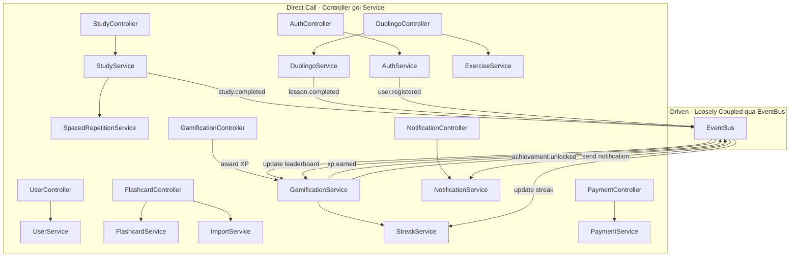

**Quy tac:** Service A KHONG DUOC `require` Service B truc tiep (tru truong hop cung module nhu GamificationService goi StreakService). Giao tiep cross-module luon qua EventBus.

### 1.0.7 MVC Rules (Quy tac bat buoc cho team)

1. **Controller KHONG BAO GIO goi Model truc tiep** -- luon qua Service
2. **Service KHONG BAO GIO truy cap req/res** -- chi nhan clean data parameters
3. **Model KHONG BAO GIO chua business logic phuc tap** -- chi schema, hooks, static/instance methods don gian
4. **View KHONG BAO GIO goi API truc tiep trong component** -- luon qua hooks hoac API client layer
5. **Validation chia 2 tang**: Input validation (Joi) o middleware truoc Controller, Business validation o Service
6. **Error handling**: Service throw AppError -> Controller catch qua asyncHandler -> error.middleware format response
7. **Cross-module communication**: Service A KHONG DUOC require Service B truc tiep -- luon qua EventBus
8. **BaseService**: Moi service ke thua BaseService cho CRUD chung, chi override khi can logic rieng

### 1.0.8 Middleware Chain trong MVC

```mermaid
graph LR
    Request["HTTP Request"] --> CORS["cors()"]
    CORS --> Helmet["helmet()"]
    Helmet --> BodyParser["express.json()"]
    BodyParser --> Sanitize["mongoSanitize()"]
    Sanitize --> RateLimit["rateLimiter"]
    RateLimit --> AuthMW["auth.middleware - JWT"]
    AuthMW --> RoleMW["role.middleware"]
    RoleMW --> ValidateMW["validation.middleware - Joi"]
    ValidateMW --> Controller["Controller Method"]
    Controller --> ErrorMW["error.middleware - Global"]
    ErrorMW --> Response["HTTP Response"]
```

---

## 1.1 KIẾN TRÚC HỆ THỐNG TỔNG THỂ

### 1.1.1 Tổng quan kiến trúc

Áp dụng **Modular Monolith evolving to Microservices** -- phù hợp cho startup 3 người. Giai đoạn MVP dùng modular monolith với clear boundaries, sau đó tách microservices khi scale.

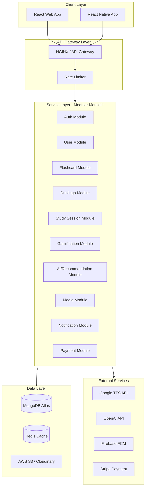

### 1.1.2 Reasoning kỹ thuật

- **Tại sao MVC + Service Layer?** MVC thuan (Controller goi Model truc tiep) dan den fat controllers. Them Service Layer giup: (1) Controller mong, chi lo req/res, (2) Business logic tap trung, de-test, de-reuse, (3) Service co the goi nhieu Models -- phuc vu cross-cutting concerns.
- **Tại sao Modular Monolith trước?** Team 3 người, microservices full sẽ tốn quá nhiều overhead (DevOps, inter-service communication, distributed tracing). Modular monolith cho phép tách service boundaries rõ ràng nhưng deploy đơn giản.
- **Tại sao Redis?** Cache leaderboard, session, flashcard sets phổ biến. Giảm load MongoDB 60-70%.
- **Tại sao S3/Cloudinary?** Lưu trữ media (audio, images) tách biệt, CDN delivery nhanh.

---

## 2. MICROSERVICE ARCHITECTURE (Target Architecture)

Khi scale lên, tách thành các microservices:

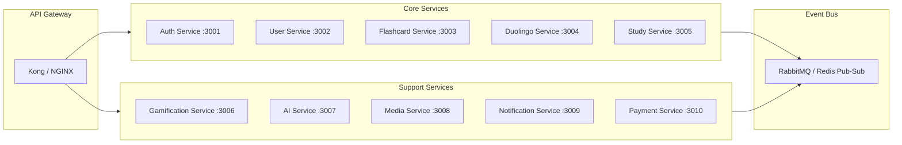

### Service Communication

| Pattern | Use Case |
|---|---|
| Synchronous (REST) | Client-to-service, real-time queries |
| Asynchronous (Event Bus) | XP earned -> update leaderboard, lesson complete -> update progress |

Events chính:
- `user.registered` -> tạo profile, gửi welcome email
- `study.completed` -> cập nhật XP, streak, progress
- `xp.earned` -> cập nhật leaderboard
- `achievement.unlocked` -> gửi notification
- `flashcard.reviewed` -> cập nhật spaced repetition schedule

### Migration Roadmap: Monolith -> Microservices

Lộ trình chuyển đổi cụ thể với tiêu chí rõ ràng cho từng giai đoạn:

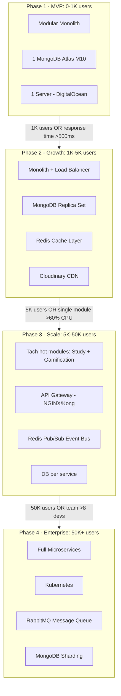

**Tieu chi chuyen doi cu the:**

| Tu Phase | Sang Phase | Khi nao chuyen? | Dau hieu |
|---|---|---|---|
| 1 -> 2 | Monolith -> Monolith scaled | >1K users HOAC response >500ms | API cham, MongoDB CPU >70% |
| 2 -> 3 | Monolith -> Partial microservices | >5K users HOAC 1 module chiem >60% traffic | Study/Gamification la bottleneck |
| 3 -> 4 | Partial -> Full microservices | >50K users HOAC team >8 devs | Can deploy modules doc lap |

**Cach tach module trong Phase 3 (chi tiet):**

1. **Buoc 1:** Tach Gamification Service ra truoc (XP, streak, leaderboard chiem nhieu write operations)
   - Tao repo rieng `englearn-gamification-service`
   - Dung Redis Pub/Sub nhan events tu monolith (`study.completed`, `lesson.completed`)
   - Monolith goi Gamification qua internal REST hoac event

2. **Buoc 2:** Tach Study Session Service (nhieu read/write khi nhieu user hoc cung luc)
   - Tao repo rieng `englearn-study-service`
   - Co database rieng cho study sessions

3. **Buoc 3:** Tach AI Service (can scale doc lap, co the dung GPU server)
   - Tao repo rieng `englearn-ai-service`
   - Deploy tren server co GPU neu can

**Giu nguyen trong monolith (khong can tach):**
- Auth, User, Payment -- it traffic, khong phai bottleneck
- Flashcard CRUD -- read-heavy nhung Redis cache giai quyet duoc
- Notification -- nhe, chi push messages

**Chuan bi san trong code monolith de de tach sau:**
- Moi module KHONG import truc tiep tu module khac -- giao tiep qua EventBus
- Service classes nhan dependencies qua constructor (Dependency Injection)
- Khong share Mongoose models giua modules -- moi module co models rieng
- API routes co prefix ro rang: `/api/gamification/*`, `/api/study/*`

---

## 3. UML CLASS DIAGRAM (OOP)

> Class Diagram duoc cap nhat theo ban ve Memoris Diagram cuoi cung. Bao gom tat ca cac class moi: Folder, Note, Tag, MistakeLog, LearningPreferences (tach rieng), LearningHistory, SkillProgress, DailyQuest, UserAchievement, Notification.

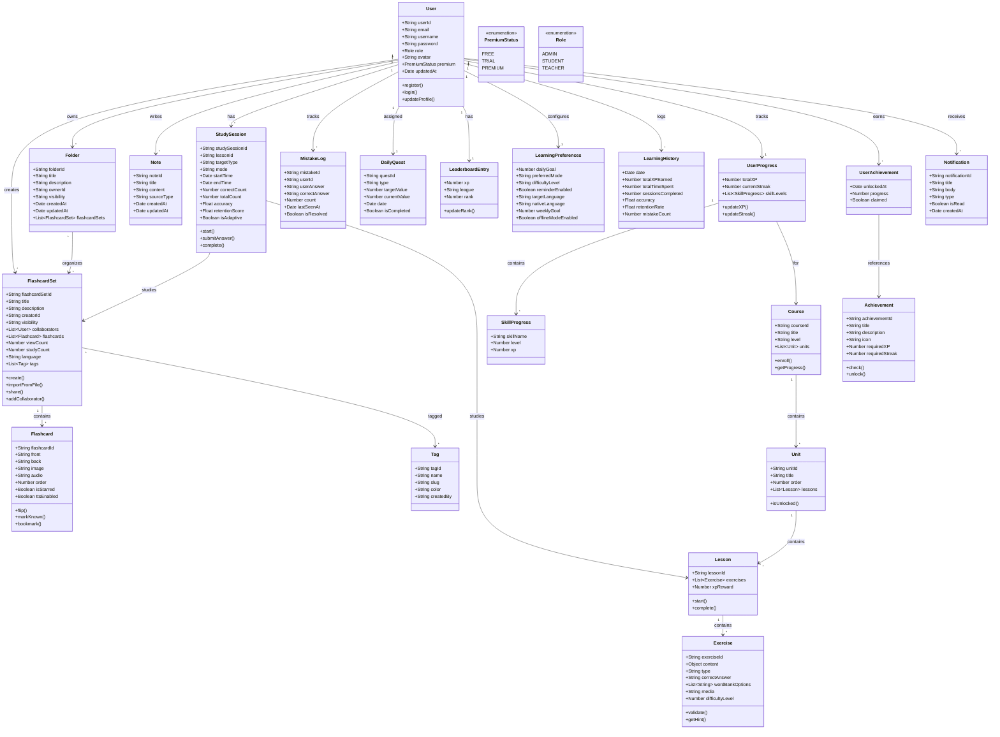

---

## 4. USE CASE DIAGRAM

```mermaid
graph TB
    subgraph actors [Actors]
        Guest["Guest"]
        Student["Student"]
        Premium["Premium User"]
        Admin["Admin"]
    end

    subgraph quizletUC [Quizlet Use Cases]
        UC1["Browse Public Sets"]
        UC2["Create Flashcard Set"]
        UC3["Import Flashcards"]
        UC4["Study Flashcards"]
        UC5["Take Test/Quiz"]
        UC6["Share Set"]
        UC7["Collaborative Edit"]
    end

    subgraph duolingoUC [Duolingo Use Cases]
        UC8["Browse Courses"]
        UC9["Start Lesson"]
        UC10["Complete Exercises"]
        UC11["Track Progress"]
        UC12["Join League"]
    end

    subgraph commonUC [Common Use Cases]
        UC13["Register/Login"]
        UC14["Manage Profile"]
        UC15["View Leaderboard"]
        UC16["Earn XP/Badges"]
        UC17["Set Daily Goals"]
        UC18["Get AI Recommendations"]
        UC19["Subscribe Premium"]
        UC20["Receive Notifications"]
    end

    subgraph adminUC [Admin Use Cases]
        UC21["Manage Users"]
        UC22["Manage Content"]
        UC23["View Analytics"]
        UC24["Moderate Content"]
    end

    Guest --> UC1
    Guest --> UC8
    Guest --> UC13

    Student --> UC2
    Student --> UC3
    Student --> UC4
    Student --> UC5
    Student --> UC6
    Student --> UC9
    Student --> UC10
    Student --> UC11
    Student --> UC12
    Student --> UC14
    Student --> UC15
    Student --> UC16
    Student --> UC17
    Student --> UC18
    Student --> UC20

    Premium --> UC7
    Premium --> UC19

    Admin --> UC21
    Admin --> UC22
    Admin --> UC23
    Admin --> UC24
```

---

## 5. SEQUENCE DIAGRAMS

### 5.1 Study Flashcard Flow

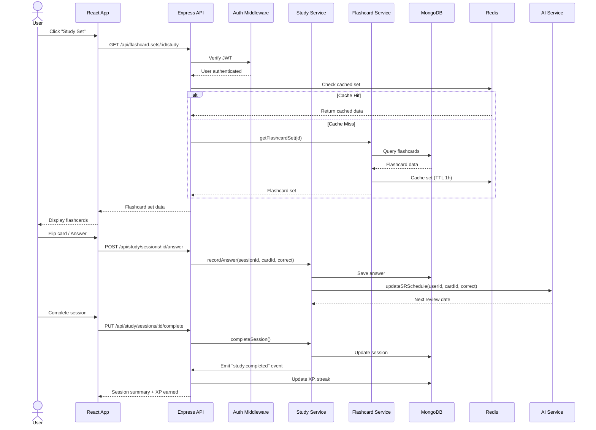

### 5.2 Duolingo Lesson Flow

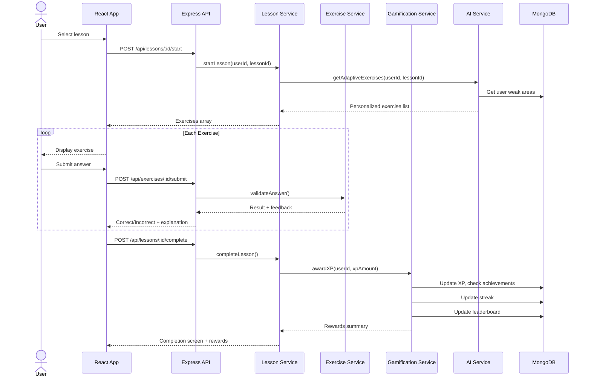

### 5.3 Authentication Flow

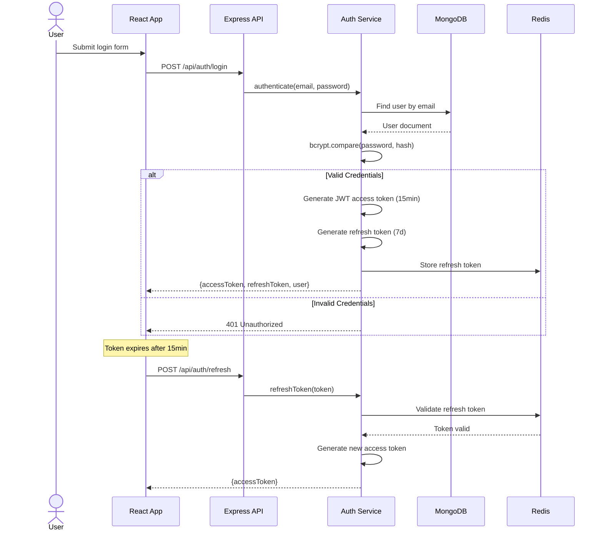

---

## 6. ERD DATABASE MONGODB

### 6.1 Relationships Overview

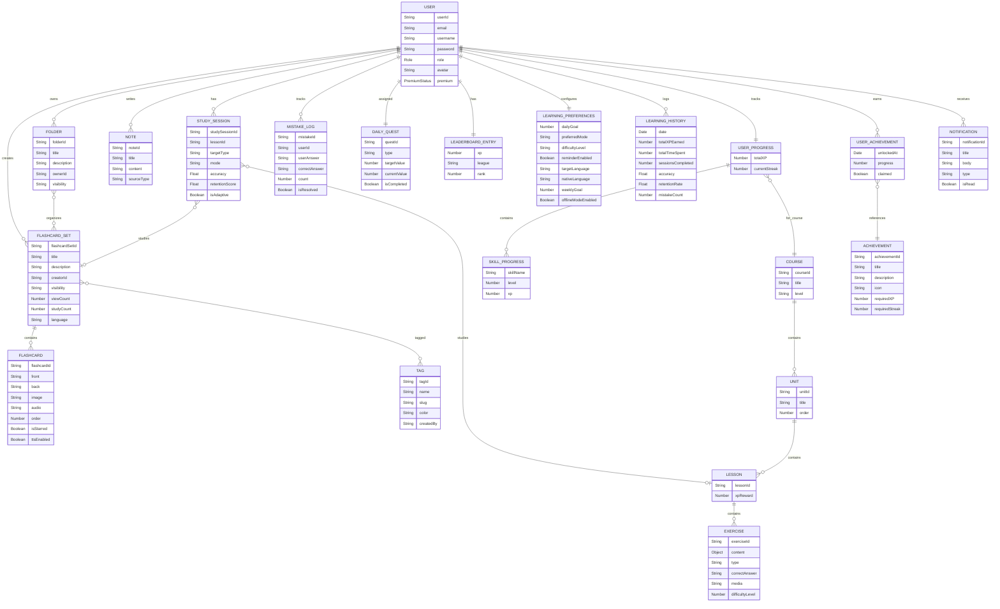

---

## 7. THIẾT KẾ COLLECTIONS + SCHEMAS


### 7.1 Users Collection

```javascript
const UserSchema = new Schema({
  email: { type: String, required: true, unique: true, lowercase: true, trim: true },
  username: { type: String, required: true, unique: true, minlength: 3, maxlength: 30 },
  password: { type: String, required: true, select: false },
  role: { type: String, enum: ['admin', 'student', 'teacher'], default: 'student' },
  avatar: { type: String, default: null },
  premium: { type: String, enum: ['free', 'trial', 'premium'], default: 'free' },
  oauth: { googleId: String, facebookId: String },
  isVerified: { type: Boolean, default: false },
  lastLoginAt: Date,
}, { timestamps: true });

UserSchema.index({ email: 1 });
UserSchema.index({ username: 1 });
```

### 7.2 Flashcard Sets Collection

```javascript
const FlashcardSetSchema = new Schema({
  title: { type: String, required: true, maxlength: 200 },
  description: { type: String, maxlength: 2000 },
  creator: { type: Schema.Types.ObjectId, ref: 'User', required: true },
  visibility: { type: String, enum: ['public', 'private'], default: 'private' },
  collaborators: [{ type: Schema.Types.ObjectId, ref: 'User' }],
  viewCount: { type: Number, default: 0 },
  studyCount: { type: Number, default: 0 },
  language: { type: String, default: 'en' },
  tags: [{ type: Schema.Types.ObjectId, ref: 'Tag' }],
}, { timestamps: true });

FlashcardSetSchema.index({ creator: 1 });
FlashcardSetSchema.index({ visibility: 1, studyCount: -1 });
FlashcardSetSchema.index({ title: 'text', description: 'text' });
```

### 7.3 Flashcards Collection

```javascript
const FlashcardSchema = new Schema({
  set: { type: Schema.Types.ObjectId, ref: 'FlashcardSet', required: true },
  front: { type: String, required: true },
  back: { type: String, required: true },
  image: String,
  audio: String,
  order: { type: Number, default: 0 },
  isStarred: { type: Boolean, default: false },
  ttsEnabled: { type: Boolean, default: false },
}, { timestamps: true });

FlashcardSchema.index({ set: 1, order: 1 });
```

### 7.4 Tags Collection

```javascript
const TagSchema = new Schema({
  name: { type: String, required: true, unique: true },
  slug: { type: String, required: true, unique: true, lowercase: true },
  color: { type: String, default: '#3B82F6' },
  createdBy: { type: Schema.Types.ObjectId, ref: 'User' },
}, { timestamps: true });

TagSchema.index({ slug: 1 });
```

### 7.5 Folders Collection

```javascript
const FolderSchema = new Schema({
  title: { type: String, required: true },
  description: String,
  owner: { type: Schema.Types.ObjectId, ref: 'User', required: true },
  visibility: { type: String, enum: ['public', 'private'], default: 'private' },
  flashcardSets: [{ type: Schema.Types.ObjectId, ref: 'FlashcardSet' }],
}, { timestamps: true });

FolderSchema.index({ owner: 1 });
```

### 7.6 Notes Collection

```javascript
const NoteSchema = new Schema({
  user: { type: Schema.Types.ObjectId, ref: 'User', required: true },
  title: { type: String, required: true },
  content: { type: String, required: true },
  sourceType: { type: String, enum: ['manual', 'pdf', 'import'], default: 'manual' },
}, { timestamps: true });

NoteSchema.index({ user: 1, createdAt: -1 });
```

### 7.7 Study Sessions Collection

```javascript
const StudySessionSchema = new Schema({
  user: { type: Schema.Types.ObjectId, ref: 'User', required: true },
  lesson: { type: Schema.Types.ObjectId, ref: 'Lesson' },
  set: { type: Schema.Types.ObjectId, ref: 'FlashcardSet' },
  targetType: { type: String, enum: ['lesson', 'flashcard_set'], required: true },
  mode: { type: String, required: true },
  startTime: { type: Date, default: Date.now },
  endTime: Date,
  correctCount: { type: Number, default: 0 },
  totalCount: { type: Number, default: 0 },
  accuracy: { type: Number, default: 0 },
  retentionScore: { type: Number, default: 0 },
  isAdaptive: { type: Boolean, default: false },
}, { timestamps: true });

StudySessionSchema.index({ user: 1, createdAt: -1 });
```

### 7.8 Mistake Logs Collection

```javascript
const MistakeLogSchema = new Schema({
  user: { type: Schema.Types.ObjectId, ref: 'User', required: true },
  session: { type: Schema.Types.ObjectId, ref: 'StudySession' },
  exercise: { type: Schema.Types.ObjectId, ref: 'Exercise' },
  flashcard: { type: Schema.Types.ObjectId, ref: 'Flashcard' },
  userAnswer: { type: String, required: true },
  correctAnswer: { type: String, required: true },
  count: { type: Number, default: 1 },
  lastSeenAt: { type: Date, default: Date.now },
  isResolved: { type: Boolean, default: false },
}, { timestamps: true });

MistakeLogSchema.index({ user: 1, isResolved: 1 });
```

### 7.5 Courses Collection (Duolingo Mode)

```javascript
const CourseSchema = new Schema({
  title: { type: String, required: true },
  slug: { type: String, unique: true },
  description: String,
  language: { from: String, to: String },
  level: { type: String, enum: ['beginner', 'elementary', 'intermediate', 'upper_intermediate', 'advanced'] },
  thumbnail: String,
  totalXP: Number,
  isPublished: { type: Boolean, default: false },
  enrollCount: { type: Number, default: 0 },
}, { timestamps: true });
```

### 7.6 Units Collection

```javascript
const UnitSchema = new Schema({
  course: { type: Schema.Types.ObjectId, ref: 'Course', required: true },
  title: { type: String, required: true },
  description: String,
  order: { type: Number, required: true },
  unlockCriteria: {
    type: { type: String, enum: ['previous_complete', 'xp_threshold', 'none'], default: 'previous_complete' },
    value: Schema.Types.Mixed,
  },
  color: String, // UI theme color for this unit
  icon: String,
}, { timestamps: true });

UnitSchema.index({ course: 1, order: 1 });
```

### 7.7 Lessons Collection

```javascript
const LessonSchema = new Schema({
  unit: { type: Schema.Types.ObjectId, ref: 'Unit', required: true },
  title: { type: String, required: true },
  type: { type: String, enum: ['vocabulary', 'grammar', 'writing', 'listening', 'translation', 'review'], required: true },
  order: { type: Number, required: true },
  xpReward: { type: Number, default: 10 },
  exerciseCount: { type: Number, default: 0 },
  estimatedMinutes: { type: Number, default: 5 },
  difficulty: { type: Number, default: 1, min: 1, max: 5 },
}, { timestamps: true });

LessonSchema.index({ unit: 1, order: 1 });
```

### 7.8 Exercises Collection

```javascript
const ExerciseSchema = new Schema({
  lesson: { type: Schema.Types.ObjectId, ref: 'Lesson', required: true },
  type: {
    type: String,
    enum: [
      'multiple_choice', 'true_false', 'fill_blank', 'typing',
      'matching', 'word_bank', 'translation', 'listening',
      'speaking', 'reorder_sentence'
    ],
    required: true,
  },
  content: {
    question: { type: String, required: true },
    questionAudio: String,
    questionImage: String,
    options: [{ text: String, isCorrect: Boolean }],
    correctAnswer: { type: String, required: true },
    acceptedAnswers: [String], // alternative correct answers
    pairs: [{ left: String, right: String }], // for matching
    wordBank: [String], // for word_bank type
    hint: String,
    explanation: String,
  },
  order: { type: Number, default: 0 },
  difficulty: { type: Number, default: 1, min: 1, max: 5 },
  skills: [String], // tagged skills: ['present_tense', 'vocabulary']
}, { timestamps: true });

ExerciseSchema.index({ lesson: 1, order: 1 });
```

### 7.9 User Progress Collection

```javascript
const UserProgressSchema = new Schema({
  user: { type: Schema.Types.ObjectId, ref: 'User', required: true },
  // Duolingo progress
  course: { type: Schema.Types.ObjectId, ref: 'Course' },
  completedLessons: [{ type: Schema.Types.ObjectId, ref: 'Lesson' }],
  lessonScores: [{
    lesson: { type: Schema.Types.ObjectId, ref: 'Lesson' },
    bestScore: Number,
    attempts: Number,
    lastAttemptAt: Date,
    crowns: { type: Number, default: 0, max: 5 },
  }],
  currentUnit: { type: Schema.Types.ObjectId, ref: 'Unit' },
  skillLevels: Map, // { 'present_tense': 3, 'vocabulary_food': 5 }
  weakSkills: [String],
  // Quizlet progress
  flashcardProgress: [{
    card: { type: Schema.Types.ObjectId, ref: 'Flashcard' },
    status: { type: String, enum: ['new', 'learning', 'known', 'mastered'], default: 'new' },
    easeFactor: { type: Number, default: 2.5 },
    interval: { type: Number, default: 0 },    // days
    repetitions: { type: Number, default: 0 },
    nextReviewAt: Date,
    lastReviewedAt: Date,
  }],
  // Bookmarks & favorites
  bookmarkedCards: [{ type: Schema.Types.ObjectId, ref: 'Flashcard' }],
  favoriteSets: [{ type: Schema.Types.ObjectId, ref: 'FlashcardSet' }],
}, { timestamps: true });

UserProgressSchema.index({ user: 1, course: 1 }, { unique: true });
UserProgressSchema.index({ user: 1, 'flashcardProgress.nextReviewAt': 1 });
```

### 7.10 Gamification Profile Collection

```javascript
const GamificationProfileSchema = new Schema({
  user: { type: Schema.Types.ObjectId, ref: 'User', required: true, unique: true },
  xp: {
    total: { type: Number, default: 0 },
    weekly: { type: Number, default: 0 },
    daily: { type: Number, default: 0 },
    lastResetDaily: Date,
    lastResetWeekly: Date,
  },
  level: { type: Number, default: 1 },
  streak: {
    current: { type: Number, default: 0 },
    longest: { type: Number, default: 0 },
    lastActivityDate: Date,
    freezesAvailable: { type: Number, default: 0 },
    freezeUsedToday: { type: Boolean, default: false },
  },
  league: {
    current: { type: String, enum: ['bronze', 'silver', 'gold', 'sapphire', 'ruby', 'emerald', 'amethyst', 'pearl', 'obsidian', 'diamond'], default: 'bronze' },
    promotedAt: Date,
  },
  achievements: [{
    achievement: { type: Schema.Types.ObjectId, ref: 'Achievement' },
    unlockedAt: { type: Date, default: Date.now },
  }],
  dailyQuests: [{
    type: { type: String, enum: ['earn_xp', 'complete_lessons', 'study_cards', 'perfect_score'] },
    target: Number,
    progress: { type: Number, default: 0 },
    completed: { type: Boolean, default: false },
    xpReward: Number,
    date: Date,
  }],
  stats: {
    totalStudyTime: { type: Number, default: 0 },     // minutes
    totalSessions: { type: Number, default: 0 },
    totalCardsStudied: { type: Number, default: 0 },
    totalLessonsCompleted: { type: Number, default: 0 },
    averageAccuracy: { type: Number, default: 0 },
    wordsLearned: { type: Number, default: 0 },
  },
}, { timestamps: true });

GamificationProfileSchema.index({ 'xp.weekly': -1 }); // for leaderboard
GamificationProfileSchema.index({ 'league.current': 1, 'xp.weekly': -1 });
```

### 7.11 Achievements Collection

```javascript
const AchievementSchema = new Schema({
  code: { type: String, unique: true, required: true },
  title: { type: String, required: true },
  description: String,
  icon: String,
  category: { type: String, enum: ['streak', 'xp', 'study', 'social', 'mastery', 'special'] },
  criteria: {
    type: { type: String, required: true },
    threshold: Number,
  },
  xpReward: { type: Number, default: 0 },
  rarity: { type: String, enum: ['common', 'rare', 'epic', 'legendary'], default: 'common' },
});
// Example: { code: 'streak_7', title: '7-Day Streak', criteria: { type: 'streak', threshold: 7 } }
```

### 7.12 Subscriptions Collection

```javascript
const SubscriptionSchema = new Schema({
  user: { type: Schema.Types.ObjectId, ref: 'User', required: true },
  plan: { type: String, enum: ['free', 'monthly', 'yearly', 'lifetime'], default: 'free' },
  status: { type: String, enum: ['active', 'cancelled', 'expired', 'trial'], default: 'active' },
  stripeCustomerId: String,
  stripeSubscriptionId: String,
  currentPeriodStart: Date,
  currentPeriodEnd: Date,
  cancelledAt: Date,
  features: {
    adFree: { type: Boolean, default: false },
    offlineLearning: { type: Boolean, default: false },
    unlimitedTests: { type: Boolean, default: false },
    advancedAnalytics: { type: Boolean, default: false },
    aiChat: { type: Boolean, default: false },
  },
}, { timestamps: true });

SubscriptionSchema.index({ user: 1 });
SubscriptionSchema.index({ status: 1, currentPeriodEnd: 1 });
```

### 7.13 Notifications Collection

```javascript
const NotificationSchema = new Schema({
  user: { type: Schema.Types.ObjectId, ref: 'User', required: true },
  type: { type: String, enum: ['reminder', 'achievement', 'social', 'streak', 'system', 'promotion'] },
  title: String,
  body: String,
  data: Schema.Types.Mixed,
  read: { type: Boolean, default: false },
  pushSent: { type: Boolean, default: false },
  expiresAt: Date,
}, { timestamps: true });

NotificationSchema.index({ user: 1, read: 1, createdAt: -1 });
NotificationSchema.index({ expiresAt: 1 }, { expireAfterSeconds: 0 }); // TTL
```

### MongoDB Design Principles Applied

- **Embedding vs Referencing**: Embed khi data nhỏ, ít thay đổi, luôn query cùng nhau (ví dụ: `profile` trong `User`). Reference khi data lớn, query độc lập (ví dụ: `Flashcard` tách khỏi `FlashcardSet`).
- **Indexes**: Compound indexes cho queries phổ biến. Text indexes cho search. TTL indexes cho data tạm thời.
- **Denormalization**: `cardCount` trong `FlashcardSet`, `exerciseCount` trong `Lesson` -- tránh count queries tốn kém.
- **Schema Validation**: Mongoose validation đảm bảo data integrity ở application level.

---

## 8. THIẾT KẾ BACKEND APIs RESTful

### 8.1 Authentication APIs

```
POST   /api/auth/register          - Đăng ký tài khoản
POST   /api/auth/login             - Đăng nhập
POST   /api/auth/logout            - Đăng xuất
POST   /api/auth/refresh           - Refresh access token
POST   /api/auth/forgot-password   - Quên mật khẩu
POST   /api/auth/reset-password    - Reset mật khẩu
POST   /api/auth/verify-email      - Xác minh email
POST   /api/auth/google            - Đăng nhập Google OAuth
```

### 8.2 User APIs

```
GET    /api/users/me               - Lấy thông tin user hiện tại
PUT    /api/users/me               - Cập nhật profile
PUT    /api/users/me/avatar        - Upload avatar
PUT    /api/users/me/preferences   - Cập nhật preferences
GET    /api/users/me/stats         - Thống kê học tập
GET    /api/users/:id/profile      - Xem profile user khác (public)
DELETE /api/users/me               - Xóa tài khoản
```

### 8.3 Flashcard Set APIs (Quizlet Mode)

```
GET    /api/flashcard-sets                     - Danh sách sets (filter, search, pagination)
POST   /api/flashcard-sets                     - Tạo set mới
GET    /api/flashcard-sets/:id                 - Chi tiết set
PUT    /api/flashcard-sets/:id                 - Cập nhật set
DELETE /api/flashcard-sets/:id                 - Xóa set
POST   /api/flashcard-sets/:id/duplicate       - Nhân bản set
POST   /api/flashcard-sets/import              - Import từ file (Excel/CSV/PDF)

GET    /api/flashcard-sets/:id/cards           - Danh sách cards trong set
POST   /api/flashcard-sets/:id/cards           - Thêm card
PUT    /api/flashcard-sets/:id/cards/:cardId   - Sửa card
DELETE /api/flashcard-sets/:id/cards/:cardId   - Xóa card
PUT    /api/flashcard-sets/:id/cards/bulk      - Bulk edit cards
POST   /api/flashcard-sets/:id/cards/reorder   - Sắp xếp lại cards

POST   /api/flashcard-sets/:id/share           - Chia sẻ set
PUT    /api/flashcard-sets/:id/collaborators   - Quản lý collaborators
POST   /api/flashcard-sets/:id/bookmark        - Bookmark set
DELETE /api/flashcard-sets/:id/bookmark        - Bỏ bookmark
```

### 8.4 Study Session APIs

```
POST   /api/study/sessions                 - Bắt đầu study session
PUT    /api/study/sessions/:id             - Cập nhật session
PUT    /api/study/sessions/:id/complete    - Hoàn thành session
POST   /api/study/sessions/:id/answer      - Submit câu trả lời
GET    /api/study/sessions/:id/results     - Kết quả session
GET    /api/study/history                  - Lịch sử học tập

GET    /api/study/review-cards             - Cards cần ôn tập (spaced repetition)
PUT    /api/study/cards/:cardId/status     - Cập nhật trạng thái card (known/learning)
```

### 8.5 Course APIs (Duolingo Mode)

```
GET    /api/courses                            - Danh sách courses
GET    /api/courses/:id                        - Chi tiết course
POST   /api/courses/:id/enroll                 - Đăng ký course
GET    /api/courses/:id/progress               - Tiến trình course

GET    /api/courses/:courseId/units             - Danh sách units
GET    /api/units/:id/lessons                  - Danh sách lessons trong unit

POST   /api/lessons/:id/start                  - Bắt đầu lesson
POST   /api/lessons/:id/complete               - Hoàn thành lesson
GET    /api/lessons/:id/exercises              - Lấy exercises cho lesson
POST   /api/exercises/:id/submit               - Submit câu trả lời exercise
```

### 8.6 Gamification APIs

```
GET    /api/gamification/profile           - Profile gamification (XP, streak, level)
GET    /api/gamification/leaderboard       - Bảng xếp hạng (weekly)
GET    /api/gamification/leaderboard/:league  - BXH theo league
GET    /api/gamification/achievements      - Danh sách achievements
GET    /api/gamification/daily-quests      - Daily quests
POST   /api/gamification/daily-quests/:id/claim  - Claim quest reward
GET    /api/gamification/streak            - Chi tiết streak
POST   /api/gamification/streak/freeze     - Sử dụng streak freeze
```

### 8.7 AI APIs

```
POST   /api/ai/chat                    - Chat với AI (Q-Chat)
GET    /api/ai/recommendations         - Gợi ý bài học
POST   /api/ai/generate-quiz           - AI tạo quiz từ nội dung
POST   /api/ai/explain                 - AI giải thích từ/câu
GET    /api/ai/review-schedule         - Lịch ôn tập thông minh
POST   /api/ai/analyze-weakness        - Phân tích điểm yếu
```

### 8.8 Notification APIs

```
GET    /api/notifications              - Danh sách notifications
PUT    /api/notifications/:id/read     - Đánh dấu đã đọc
PUT    /api/notifications/read-all     - Đọc tất cả
DELETE /api/notifications/:id          - Xóa notification
PUT    /api/notifications/settings     - Cài đặt notification
```

### 8.9 Subscription/Payment APIs

```
GET    /api/subscriptions/plans        - Danh sách plans
GET    /api/subscriptions/current      - Subscription hiện tại
POST   /api/subscriptions/checkout     - Tạo checkout session (Stripe)
POST   /api/subscriptions/webhook      - Stripe webhook
POST   /api/subscriptions/cancel       - Hủy subscription
```

### 8.10 Admin APIs

```
GET    /api/admin/users                - Quản lý users
GET    /api/admin/analytics            - Thống kê hệ thống
PUT    /api/admin/users/:id/role       - Thay đổi role
POST   /api/admin/courses              - Tạo course (Duolingo)
PUT    /api/admin/courses/:id          - Sửa course
POST   /api/admin/courses/:id/units    - Thêm unit
POST   /api/admin/units/:id/lessons    - Thêm lesson
POST   /api/admin/lessons/:id/exercises - Thêm exercise
GET    /api/admin/reports              - Reports
```

### 8.11 Health Check API

```
GET    /api/health                  - Basic health check (public, no auth)
GET    /api/health/ready            - Readiness check (MongoDB + Redis connectivity)
```

**Health Check Response:**
```javascript
// GET /api/health
{
  "status": "ok",
  "timestamp": "2026-05-08T03:00:00.000Z",
  "uptime": 86400,
  "version": "1.0.0"
}

// GET /api/health/ready
{
  "status": "ok",
  "services": {
    "mongodb": { "status": "connected", "latency": "2ms" },
    "redis": { "status": "connected", "latency": "1ms" }
  }
}
```

**Implementation -- `health.routes.js`:**
```javascript
router.get('/health', (req, res) => {
  res.json({
    status: 'ok',
    timestamp: new Date().toISOString(),
    uptime: process.uptime(),
    version: process.env.npm_package_version || '1.0.0',
  });
});

router.get('/health/ready', async (req, res) => {
  try {
    const mongoStatus = mongoose.connection.readyState === 1 ? 'connected' : 'disconnected';
    const redisStatus = await redisClient.ping() === 'PONG' ? 'connected' : 'disconnected';
    const allReady = mongoStatus === 'connected' && redisStatus === 'connected';
    res.status(allReady ? 200 : 503).json({
      status: allReady ? 'ok' : 'degraded',
      services: { mongodb: { status: mongoStatus }, redis: { status: redisStatus } },
    });
  } catch (err) {
    res.status(503).json({ status: 'error', message: err.message });
  }
});
```

### API Response Format

```javascript
// Success
{
  "success": true,
  "data": { ... },
  "meta": {
    "page": 1,
    "limit": 20,
    "total": 150,
    "totalPages": 8
  }
}

// Error
{
  "success": false,
  "error": {
    "code": "VALIDATION_ERROR",
    "message": "Email is required",
    "details": [{ "field": "email", "message": "Email is required" }]
  }
}
```

---

## 9. FOLDER STRUCTURE

### 9.1 Backend (Express + Node.js) -- MVC Architecture

Moi module tuong ung voi 1 MVC triad day du: Model + Controller + Service (business logic tach khoi Controller), Routes (dinh nghia endpoints), Validation (input checking).

```
server/
├── src/
│   ├── config/                          # [INFRA] Configuration
│   │   ├── database.js                  # MongoDB connection
│   │   ├── redis.js                     # Redis connection
│   │   ├── cloudinary.js               # Media upload config
│   │   ├── stripe.js                    # Payment config
│   │   └── env.js                       # Environment variables validation
│   │
│   ├── modules/                         # [MVC MODULES] Each = Model+Controller+Service
│   │   │
│   │   ├── auth/                        # === AUTH MODULE ===
│   │   │   ├── auth.controller.js       # [C] Handle req/res for auth endpoints
│   │   │   ├── auth.service.js          # [S] Business logic: register, login, refresh
│   │   │   ├── auth.routes.js           # [R] POST /auth/login, /auth/register, etc.
│   │   │   ├── auth.validation.js       # [V] Joi schemas for input validation
│   │   │   └── auth.test.js             # [T] Unit tests
│   │   │
│   │   ├── user/                        # === USER MODULE ===
│   │   │   ├── user.model.js            # [M] Mongoose schema, hooks, statics
│   │   │   ├── user.controller.js       # [C] Handle profile CRUD requests
│   │   │   ├── user.service.js          # [S] Profile update, stats calculation
│   │   │   ├── user.routes.js           # [R] GET/PUT /users/me, etc.
│   │   │   └── user.validation.js       # [V] Joi schemas
│   │   │
│   │   ├── flashcard/                   # === FLASHCARD MODULE (Quizlet) ===
│   │   │   ├── models/                  # [M] Multiple models for this domain
│   │   │   │   ├── flashcardSet.model.js  # Schema for flashcard sets
│   │   │   │   ├── flashcard.model.js     # Schema for individual cards
│   │   │   │   ├── tag.model.js           # Schema for tags
│   │   │   │   ├── folder.model.js        # Schema for folders
│   │   │   │   └── note.model.js          # Schema for notes
│   │   │   ├── flashcard.controller.js  # [C] Handle set/card CRUD requests
│   │   │   ├── flashcard.service.js     # [S] Set management, search, share logic
│   │   │   ├── import.service.js        # [S] File import business logic
│   │   │   ├── flashcard.routes.js      # [R] CRUD /flashcard-sets, /cards, /tags, /folders, /notes
│   │   │   └── flashcard.validation.js  # [V] Joi schemas
│   │   │
│   │   ├── duolingo/                    # === DUOLINGO MODULE ===
│   │   │   ├── models/                  # [M] Course domain models
│   │   │   │   ├── course.model.js
│   │   │   │   ├── unit.model.js
│   │   │   │   ├── lesson.model.js
│   │   │   │   └── exercise.model.js
│   │   │   ├── duolingo.controller.js   # [C] Handle course/lesson requests
│   │   │   ├── duolingo.service.js      # [S] Course enrollment, unit unlocking
│   │   │   ├── exercise.service.js      # [S] Exercise validation, scoring
│   │   │   ├── duolingo.routes.js       # [R] /courses, /lessons, /exercises
│   │   │   └── duolingo.validation.js   # [V] Joi schemas
│   │   │
│   │   ├── study/                       # === STUDY SESSION MODULE ===
│   │   │   ├── models/
│   │   │   │   ├── studySession.model.js   # targetType, mode, accuracy, retentionScore
│   │   │   │   └── mistakeLog.model.js     # userAnswer, correctAnswer, isResolved
│   │   │   ├── study.controller.js      # [C] Handle session start/complete
│   │   │   ├── study.service.js         # [S] Session management, scoring
│   │   │   ├── spacedRepetition.service.js # [S] SM-2 algorithm logic
│   │   │   ├── study.routes.js          # [R] /study/sessions, /study/review
│   │   │   └── study.validation.js      # [V] Joi schemas
│   │   │
│   │   ├── gamification/                # === GAMIFICATION MODULE ===
│   │   │   ├── models/                  # [M] Gamification domain models
│   │   │   │   ├── userProgress.model.js    # totalXP, currentStreak, skillLevels
│   │   │   │   ├── achievement.model.js     # requiredXP, requiredStreak
│   │   │   │   ├── userAchievement.model.js # unlockedAt, progress, claimed
│   │   │   │   ├── dailyQuest.model.js      # type, targetValue, isCompleted
│   │   │   │   ├── leaderboardEntry.model.js # xp, league, rank
│   │   │   │   ├── learningHistory.model.js  # daily stats log
│   │   │   │   └── learningPreferences.model.js # dailyGoal, targetLanguage
│   │   │   ├── gamification.controller.js # [C] Handle XP/streak/leaderboard requests
│   │   │   ├── gamification.service.js  # [S] Orchestrate gamification logic
│   │   │   ├── xp.service.js            # [S] XP calculation rules
│   │   │   ├── streak.service.js        # [S] Streak tracking rules
│   │   │   ├── achievement.service.js   # [S] Achievement checking rules
│   │   │   ├── gamification.routes.js   # [R] /gamification/profile, /leaderboard
│   │   │   └── gamification.validation.js # [V] Joi schemas
│   │   │
│   │   ├── ai/                          # === AI MODULE ===
│   │   │   ├── ai.controller.js         # [C] Handle AI chat/recommendation requests
│   │   │   ├── ai.service.js            # [S] Orchestrate AI features
│   │   │   ├── recommendation.service.js # [S] Personalized recommendation logic
│   │   │   ├── chatbot.service.js       # [S] OpenAI integration for Q-Chat
│   │   │   ├── ai.routes.js             # [R] /ai/chat, /ai/recommendations
│   │   │   └── ai.validation.js         # [V] Joi schemas
│   │   │
│   │   ├── notification/                # === NOTIFICATION MODULE ===
│   │   │   ├── notification.model.js    # [M] Notification schema
│   │   │   ├── notification.controller.js # [C] Handle notification requests
│   │   │   ├── notification.service.js  # [S] Notification creation, marking read
│   │   │   ├── push.service.js          # [S] Firebase FCM push logic
│   │   │   ├── notification.routes.js   # [R] /notifications
│   │   │   └── notification.validation.js # [V] Joi schemas
│   │   │
│   │   ├── media/                       # === MEDIA MODULE ===
│   │   │   ├── media.controller.js      # [C] Handle upload/TTS requests
│   │   │   ├── media.service.js         # [S] Upload to S3/Cloudinary
│   │   │   ├── tts.service.js           # [S] Text-to-Speech logic
│   │   │   ├── media.routes.js          # [R] /media/upload, /media/tts
│   │   │   └── media.validation.js      # [V] Joi schemas
│   │   │
│   │   ├── payment/                     # === PAYMENT MODULE ===
│   │   │   ├── subscription.model.js    # [M] Subscription schema
│   │   │   ├── payment.controller.js    # [C] Handle payment/subscription requests
│   │   │   ├── payment.service.js       # [S] Stripe integration logic
│   │   │   ├── webhook.handler.js       # [C] Stripe webhook controller
│   │   │   ├── payment.routes.js        # [R] /subscriptions
│   │   │   └── payment.validation.js    # [V] Joi schemas
│   │   │
│   │   └── admin/                       # === ADMIN MODULE ===
│   │       ├── admin.controller.js      # [C] Handle admin CRUD requests
│   │       ├── admin.service.js         # [S] Admin business logic
│   │       ├── admin.routes.js          # [R] /admin/*
│   │       └── admin.validation.js      # [V] Joi schemas
│   │
│   ├── middleware/                       # [MVC] Middleware = pre-Controller processing
│   │   ├── auth.middleware.js           # JWT verification -> attaches req.user
│   │   ├── role.middleware.js           # Role-based access control check
│   │   ├── rateLimiter.middleware.js    # Request throttling
│   │   ├── validation.middleware.js     # Joi schema validation runner
│   │   ├── upload.middleware.js         # Multer file upload handling
│   │   ├── premium.middleware.js        # Premium feature gate
│   │   └── error.middleware.js          # Global error handler (catches AppError)
│   │
│   ├── shared/                          # [CROSS-CUTTING] Shared utilities
│   │   ├── utils/
│   │   │   ├── apiResponse.js           # Standardized response format
│   │   │   ├── asyncHandler.js          # Async error wrapper for controllers
│   │   │   ├── pagination.js            # Pagination helper
│   │   │   ├── fileParser.js            # Excel/CSV/PDF parser
│   │   │   └── validators.js            # Common validation helpers
│   │   ├── errors/
│   │   │   ├── AppError.js              # Base error class
│   │   │   ├── NotFoundError.js         # 404 error
│   │   │   └── ValidationError.js       # 422 error
│   │   ├── constants/
│   │   │   ├── roles.js
│   │   │   ├── achievements.js
│   │   │   └── leagues.js
│   │   └── events/
│   │       ├── eventBus.js              # In-process event emitter
│   │       └── eventHandlers.js         # Event listener registration
│   │
│   ├── jobs/                            # Background jobs (node-cron / Bull)
│   │   ├── streakChecker.job.js
│   │   ├── leaderboardReset.job.js
│   │   ├── reminderSender.job.js
│   │   └── dailyQuestGenerator.job.js
│   │
│   ├── seeders/                         # Database seeders
│   │   ├── courses.seeder.js
│   │   ├── achievements.seeder.js
│   │   └── sampleData.seeder.js
│   │
│   └── app.js                           # Express app setup + route mounting
│
├── tests/
│   ├── unit/                            # Unit tests (Services, Models)
│   │   ├── auth.service.test.js
│   │   ├── flashcard.service.test.js
│   │   └── xp.service.test.js
│   ├── integration/                     # Integration tests (Controller + DB)
│   │   ├── auth.test.js
│   │   └── flashcard.test.js
│   └── fixtures/                        # Test data fixtures
│
├── .env.example
├── .eslintrc.js
├── .prettierrc
├── Dockerfile
├── docker-compose.yml
├── jest.config.js
├── package.json
└── server.js                            # Entry point
```

**MVC Mapping Summary cho Backend:**

| MVC Layer | File Pattern | Responsibility |
|---|---|---|
| **Model** | `*.model.js` | Schema, validation, hooks, statics, indexes |
| **View** | React Frontend (tach repo) | Render UI, capture events |
| **Controller** | `*.controller.js` | Parse request, call service, format response |
| **Service** | `*.service.js` | Business logic, cross-model operations |
| **Routes** | `*.routes.js` | Map HTTP methods + paths -> middleware -> controller |
| **Validation** | `*.validation.js` | Joi schemas for request body/params/query |
| **Middleware** | `*.middleware.js` | Cross-cutting: auth, rate limit, error handling |

### 9.2 Frontend (React.js + Bootstrap)

```
client/
├── public/
│   ├── index.html
│   ├── manifest.json
│   └── assets/
│       ├── images/
│       ├── sounds/
│       └── icons/
│
├── src/
│   ├── api/                        # API client layer
│   │   ├── axiosClient.js          # Axios instance + interceptors
│   │   ├── auth.api.js
│   │   ├── flashcard.api.js
│   │   ├── duolingo.api.js
│   │   ├── study.api.js
│   │   ├── gamification.api.js
│   │   └── ai.api.js
│   │
│   ├── components/
│   │   ├── common/                 # Shared components
│   │   │   ├── Navbar/
│   │   │   ├── Sidebar/
│   │   │   ├── Footer/
│   │   │   ├── LoadingSpinner/
│   │   │   ├── Modal/
│   │   │   ├── Toast/
│   │   │   ├── Pagination/
│   │   │   ├── SearchBar/
│   │   │   ├── ProtectedRoute/
│   │   │   └── ErrorBoundary/
│   │   │
│   │   ├── auth/
│   │   │   ├── LoginForm/
│   │   │   ├── RegisterForm/
│   │   │   └── ForgotPassword/
│   │   │
│   │   ├── quizlet/               # Quizlet mode components
│   │   │   ├── FlashcardViewer/
│   │   │   ├── FlashcardEditor/
│   │   │   ├── FlashcardGrid/
│   │   │   ├── SetList/
│   │   │   ├── ImportModal/
│   │   │   ├── StudyModes/
│   │   │   │   ├── FlashcardsMode/
│   │   │   │   ├── LearnMode/
│   │   │   │   ├── TestMode/
│   │   │   │   ├── WriteMode/
│   │   │   │   └── MatchMode/
│   │   │   ├── ShareModal/
│   │   │   └── ProgressBar/
│   │   │
│   │   ├── duolingo/              # Duolingo mode components
│   │   │   ├── CourseCard/
│   │   │   ├── UnitTree/
│   │   │   ├── LessonBubble/
│   │   │   ├── ExerciseRenderer/
│   │   │   │   ├── MultipleChoice/
│   │   │   │   ├── FillBlank/
│   │   │   │   ├── Translation/
│   │   │   │   ├── WordBank/
│   │   │   │   ├── Matching/
│   │   │   │   ├── Typing/
│   │   │   │   └── Listening/
│   │   │   ├── ProgressHeader/
│   │   │   ├── LessonComplete/
│   │   │   └── StreakAnimation/
│   │   │
│   │   ├── gamification/
│   │   │   ├── XPBar/
│   │   │   ├── StreakCounter/
│   │   │   ├── Leaderboard/
│   │   │   ├── AchievementCard/
│   │   │   ├── DailyQuest/
│   │   │   ├── LevelBadge/
│   │   │   └── LeagueDisplay/
│   │   │
│   │   ├── ai/
│   │   │   ├── ChatBot/
│   │   │   └── Recommendations/
│   │   │
│   │   └── profile/
│   │       ├── ProfileCard/
│   │       ├── StatsChart/
│   │       ├── SettingsForm/
│   │       └── SubscriptionCard/
│   │
│   ├── pages/
│   │   ├── Home/                   # Landing page with mode selection
│   │   ├── Auth/
│   │   │   ├── LoginPage.jsx
│   │   │   └── RegisterPage.jsx
│   │   ├── Quizlet/
│   │   │   ├── QuizletHome.jsx
│   │   │   ├── CreateSet.jsx
│   │   │   ├── SetDetail.jsx
│   │   │   ├── StudyPage.jsx
│   │   │   └── BrowseSets.jsx
│   │   ├── Duolingo/
│   │   │   ├── DuolingoHome.jsx
│   │   │   ├── CoursePage.jsx
│   │   │   ├── LessonPage.jsx
│   │   │   └── ReviewPage.jsx
│   │   ├── Profile/
│   │   │   ├── ProfilePage.jsx
│   │   │   └── SettingsPage.jsx
│   │   ├── Leaderboard/
│   │   ├── Premium/
│   │   └── Admin/
│   │
│   ├── context/                    # React Context
│   │   ├── AuthContext.jsx
│   │   ├── ThemeContext.jsx
│   │   └── StudyContext.jsx
│   │
│   ├── hooks/                      # Custom hooks
│   │   ├── useAuth.js
│   │   ├── useFlashcards.js
│   │   ├── useStudySession.js
│   │   ├── useTimer.js
│   │   ├── useSound.js
│   │   └── useOffline.js
│   │
│   ├── store/                      # State management (Context + useReducer)
│   │   ├── reducers/
│   │   │   ├── authReducer.js
│   │   │   ├── studyReducer.js
│   │   │   └── gamificationReducer.js
│   │   └── actions/
│   │
│   ├── styles/
│   │   ├── bootstrap-custom.scss   # Bootstrap overrides
│   │   ├── variables.scss
│   │   ├── mixins.scss
│   │   ├── components/
│   │   └── pages/
│   │
│   ├── utils/
│   │   ├── constants.js
│   │   ├── helpers.js
│   │   ├── formatters.js
│   │   └── storage.js             # LocalStorage helpers
│   │
│   ├── App.jsx
│   ├── routes.jsx                  # React Router config
│   └── index.jsx
│
├── .env.example
├── package.json
├── vite.config.js
└── Dockerfile
```

---

## 10. AUTHENTICATION + JWT + ROLE SYSTEM

### 10.1 Architecture

```mermaid
graph TB
    subgraph authFlow [Authentication Flow]
        Login["Login Request"] --> Validate["Validate Credentials"]
        Validate --> GenAccess["Generate Access Token - 15min"]
        Validate --> GenRefresh["Generate Refresh Token - 7 days"]
        GenAccess --> SendClient["Send to Client"]
        GenRefresh --> StoreRedis["Store in Redis"]
        GenRefresh --> SendClient
    end

    subgraph tokenRefresh [Token Refresh Flow]
        Expired["Access Token Expired"] --> SendRefresh["Send Refresh Token"]
        SendRefresh --> ValidateRedis["Validate in Redis"]
        ValidateRedis --> RotateTokens["Generate New Token Pair"]
        RotateTokens --> InvalidateOld["Invalidate Old Refresh Token"]
    end

    subgraph rbac [Role-Based Access Control]
        Request["API Request"] --> JWTMiddleware["JWT Middleware"]
        JWTMiddleware --> RoleMiddleware["Role Middleware"]
        RoleMiddleware --> PremiumMiddleware["Premium Check"]
        PremiumMiddleware --> Controller["Route Handler"]
    end
```

### 10.2 Roles & Permissions

```
student:  Tất cả basic features, giới hạn study modes
premium:  student + ad-free, offline, unlimited tests, AI chat, advanced analytics
admin:    Toàn quyền quản trị hệ thống, CRUD courses/content
```

### 10.3 JWT Payload

```javascript
{
  "sub": "userId",
  "email": "user@example.com",
  "role": "student",
  "premium": false,
  "iat": 1700000000,
  "exp": 1700000900  // 15 minutes
}
```

### 10.4 Security Measures

- Password hashing: bcrypt (salt rounds 12)
- Rate limiting: 5 login attempts / 15 min per IP
- Refresh token rotation: mỗi lần refresh tạo token pair mới
- CORS whitelist: chỉ cho phép origins đã đăng ký
- Helmet.js: HTTP security headers
- Input sanitization: express-mongo-sanitize, xss-clean

---

## 11. AI RECOMMENDATION SYSTEM

### 11.1 Architecture

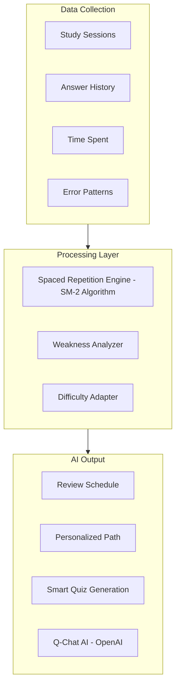

### 11.2 Spaced Repetition (SM-2 Algorithm)

```javascript
// Core SM-2 implementation for flashcard review scheduling
function calculateNextReview(card, quality) {
  // quality: 0-5 (0=complete fail, 5=perfect recall)
  let { easeFactor, interval, repetitions } = card;

  if (quality >= 3) {
    if (repetitions === 0) interval = 1;
    else if (repetitions === 1) interval = 6;
    else interval = Math.round(interval * easeFactor);
    repetitions++;
  } else {
    repetitions = 0;
    interval = 1;
  }

  easeFactor = Math.max(1.3,
    easeFactor + (0.1 - (5 - quality) * (0.08 + (5 - quality) * 0.02))
  );

  return {
    easeFactor,
    interval,
    repetitions,
    nextReviewAt: addDays(new Date(), interval),
  };
}
```

### 11.3 Adaptive Difficulty

```javascript
// Adjusts exercise difficulty based on user performance
function getAdaptiveDifficulty(userStats) {
  const recentAccuracy = userStats.last20Accuracy;
  const currentDifficulty = userStats.currentDifficulty;

  if (recentAccuracy > 0.85) return Math.min(5, currentDifficulty + 0.5);
  if (recentAccuracy < 0.60) return Math.max(1, currentDifficulty - 0.5);
  return currentDifficulty;
}
```

### 11.4 Q-Chat AI (OpenAI Integration)

- Sử dụng OpenAI GPT API với system prompt chuyên biệt cho việc dạy tiếng Anh
- Context-aware: biết user đang học topic gì, level nào
- Rate limit: 20 messages/day (free), unlimited (premium)

---

## 12. GAMIFICATION SYSTEM

### 12.1 XP System

| Action | XP |
|---|---|
| Complete flashcard session | 10-30 |
| Complete Duolingo lesson | 10-20 |
| Perfect score (lesson) | +5 bonus |
| Daily quest complete | 10-50 |
| First session of the day | +5 bonus |
| Streak bonus (7+ days) | +10 per session |

### 12.2 Level System

```
Level 1:     0 XP
Level 2:   100 XP
Level 3:   300 XP
Level 4:   600 XP
Level N:   N * (N-1) * 50 XP
```

### 12.3 League System

```
Bronze    -> Silver   (Top 10 weekly promoted)
Silver    -> Gold     (Top 10 weekly promoted)
Gold      -> Sapphire
...
Diamond   (Top league)

Bottom 5 weekly -> demoted to lower league
Leaderboard reset every Monday 00:00 UTC
```

### 12.4 Achievement Examples

```javascript
const ACHIEVEMENTS = [
  { code: 'first_set', title: 'Creator', criteria: { type: 'sets_created', threshold: 1 } },
  { code: 'streak_7', title: 'Week Warrior', criteria: { type: 'streak', threshold: 7 } },
  { code: 'streak_30', title: 'Monthly Master', criteria: { type: 'streak', threshold: 30 } },
  { code: 'xp_1000', title: 'XP Hunter', criteria: { type: 'total_xp', threshold: 1000 } },
  { code: 'perfect_10', title: 'Perfectionist', criteria: { type: 'perfect_scores', threshold: 10 } },
  { code: 'cards_500', title: 'Card Collector', criteria: { type: 'cards_studied', threshold: 500 } },
  { code: 'social_share', title: 'Sharer', criteria: { type: 'sets_shared', threshold: 1 } },
  { code: 'night_owl', title: 'Night Owl', criteria: { type: 'study_after_midnight', threshold: 5 } },
];
```

### 12.5 Daily Quests

Mỗi ngày generate 3 quests random:
- "Earn 50 XP today" (reward: 10 XP)
- "Complete 3 lessons" (reward: 20 XP)
- "Study 20 flashcards" (reward: 15 XP)
- "Get a perfect score" (reward: 25 XP)

---

## 13. DevOps + CI/CD + Docker

### 13.1 Git Branching Strategy

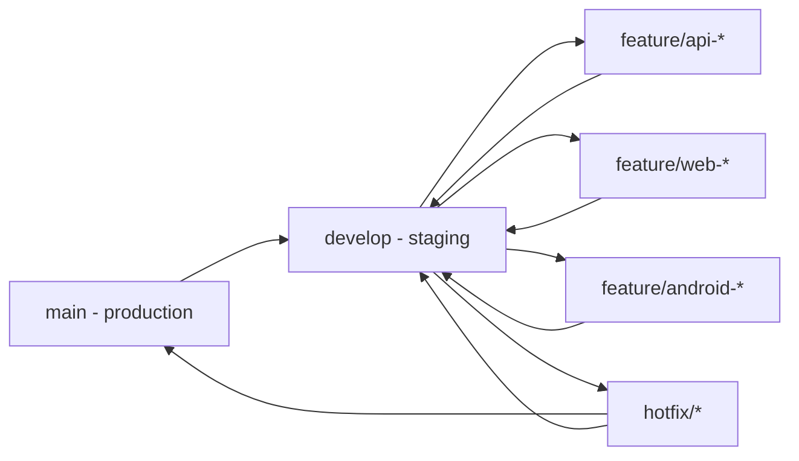

**Branch Protection Rules:**

| Branch | Rules |
|---|---|
| `main` | Require PR review (1 reviewer), require CI pass, no direct push, no force push |
| `develop` | Require CI pass, allow squash merge only |
| `feature/*` | No restrictions, auto-delete after merge |
| `hotfix/*` | Require 1 reviewer, can merge to both main + develop |

**Merge Strategy:**
- Feature -> Develop: **Squash merge** (clean history)
- Develop -> Main: **Merge commit** (keep milestone markers)
- Hotfix -> Main: **Merge commit** (traceable fixes)

**Naming Convention:**
```
feature/api-auth-jwt          # Backend feature
feature/web-flashcard-editor  # Web frontend feature
feature/android-srs-review    # Android feature
hotfix/fix-login-crash        # Production hotfix
release/v1.0.0                # Release branch (optional)
```

### 13.2 Environment Management

**3 environments:** Development, Staging, Production.

```
project-root/
├── .env.example              # Template -- commit to git
├── server/
│   ├── .env.development      # Local dev -- DO NOT commit
│   ├── .env.staging           # Staging -- DO NOT commit
│   └── .env.production        # Production -- DO NOT commit
└── client/
    ├── .env.development
    ├── .env.staging
    └── .env.production
```

**`.env.example` (template):**
```bash
# Server
NODE_ENV=development
PORT=5000
API_VERSION=v1

# MongoDB
MONGO_URI=mongodb://localhost:27017/englearndb

# Redis
REDIS_URL=redis://localhost:6379

# JWT
JWT_ACCESS_SECRET=your_access_secret_here
JWT_REFRESH_SECRET=your_refresh_secret_here
JWT_ACCESS_EXPIRES_IN=15m
JWT_REFRESH_EXPIRES_IN=7d

# OAuth
GOOGLE_CLIENT_ID=your_google_client_id
GOOGLE_CLIENT_SECRET=your_google_client_secret

# Cloudinary
CLOUDINARY_CLOUD_NAME=your_cloud_name
CLOUDINARY_API_KEY=your_api_key
CLOUDINARY_API_SECRET=your_api_secret

# Stripe
STRIPE_SECRET_KEY=your_stripe_secret
STRIPE_WEBHOOK_SECRET=your_webhook_secret

# OpenAI
OPENAI_API_KEY=your_openai_key

# Firebase (for push notifications)
FIREBASE_PROJECT_ID=your_project_id
FIREBASE_PRIVATE_KEY=your_private_key
FIREBASE_CLIENT_EMAIL=your_client_email

# Frontend URL (for CORS)
CLIENT_URL=http://localhost:3000

# Sentry
SENTRY_DSN=your_sentry_dsn
```

**Environment-specific config -- `src/config/env.js`:**
```javascript
const Joi = require('joi');

const envSchema = Joi.object({
  NODE_ENV: Joi.string().valid('development', 'staging', 'production').required(),
  PORT: Joi.number().default(5000),
  MONGO_URI: Joi.string().required(),
  REDIS_URL: Joi.string().required(),
  JWT_ACCESS_SECRET: Joi.string().min(32).required(),
  JWT_REFRESH_SECRET: Joi.string().min(32).required(),
  CLIENT_URL: Joi.string().uri().required(),
}).unknown(true);

const { error, value: env } = envSchema.validate(process.env);
if (error) {
  throw new Error(`Config validation error: ${error.message}`);
}

module.exports = {
  nodeEnv: env.NODE_ENV,
  port: env.PORT,
  mongoUri: env.MONGO_URI,
  redisUrl: env.REDIS_URL,
  jwt: {
    accessSecret: env.JWT_ACCESS_SECRET,
    refreshSecret: env.JWT_REFRESH_SECRET,
    accessExpiresIn: env.JWT_ACCESS_EXPIRES_IN || '15m',
    refreshExpiresIn: env.JWT_REFRESH_EXPIRES_IN || '7d',
  },
  clientUrl: env.CLIENT_URL,
  isProduction: env.NODE_ENV === 'production',
  isStaging: env.NODE_ENV === 'staging',
};
```

**GitHub Secrets** (khong luu .env trong repo):
```
Settings -> Secrets and variables -> Actions:
  DOCKERHUB_USERNAME
  DOCKERHUB_TOKEN
  MONGO_URI_STAGING
  MONGO_URI_PRODUCTION
  SSH_HOST_STAGING
  SSH_HOST_PRODUCTION
  SSH_PRIVATE_KEY
  SENTRY_DSN
  ... (tat ca env vars nhay cam)
```

### 13.3 Dockerfile -- Backend Server

```dockerfile
# server/Dockerfile
# --- Stage 1: Build ---
FROM node:20-alpine AS builder
WORKDIR /app
COPY package*.json ./
RUN npm ci --only=production && npm cache clean --force
COPY . .

# --- Stage 2: Production ---
FROM node:20-alpine
WORKDIR /app
RUN addgroup -S appgroup && adduser -S appuser -G appgroup

COPY --from=builder /app/node_modules ./node_modules
COPY --from=builder /app/src ./src
COPY --from=builder /app/server.js ./
COPY --from=builder /app/package.json ./

USER appuser
EXPOSE 5000

HEALTHCHECK --interval=30s --timeout=5s --start-period=10s --retries=3 \
  CMD wget --no-verbose --tries=1 --spider http://localhost:5000/api/health || exit 1

CMD ["node", "server.js"]
```

### 13.4 Dockerfile -- Frontend Client

```dockerfile
# client/Dockerfile
# --- Stage 1: Build ---
FROM node:20-alpine AS builder
WORKDIR /app
COPY package*.json ./
RUN npm ci
COPY . .
ARG VITE_API_URL
ENV VITE_API_URL=$VITE_API_URL
RUN npm run build

# --- Stage 2: Serve with NGINX ---
FROM nginx:alpine
COPY --from=builder /app/dist /usr/share/nginx/html
COPY nginx/default.conf /etc/nginx/conf.d/default.conf
EXPOSE 80

HEALTHCHECK --interval=30s --timeout=5s --retries=3 \
  CMD wget --no-verbose --tries=1 --spider http://localhost:80/ || exit 1

CMD ["nginx", "-g", "daemon off;"]
```

### 13.5 NGINX Configuration

**`nginx/nginx.conf`** -- Reverse proxy cho production:
```nginx
upstream backend {
    server server:5000;
}

server {
    listen 80;
    server_name englearn.app www.englearn.app;

    # Redirect HTTP -> HTTPS (khi co SSL)
    # return 301 https://$server_name$request_uri;

    # --- Frontend (React SPA) ---
    location / {
        root /usr/share/nginx/html;
        try_files $uri $uri/ /index.html;

        # Cache static assets
        location ~* \.(js|css|png|jpg|jpeg|gif|ico|svg|woff2)$ {
            expires 30d;
            add_header Cache-Control "public, immutable";
        }
    }

    # --- Backend API Proxy ---
    location /api/ {
        proxy_pass http://backend;
        proxy_http_version 1.1;
        proxy_set_header Upgrade $http_upgrade;
        proxy_set_header Connection 'upgrade';
        proxy_set_header Host $host;
        proxy_set_header X-Real-IP $remote_addr;
        proxy_set_header X-Forwarded-For $proxy_add_x_forwarded_for;
        proxy_set_header X-Forwarded-Proto $scheme;
        proxy_cache_bypass $http_upgrade;
        proxy_read_timeout 60s;
        proxy_send_timeout 60s;

        # Rate limiting
        limit_req zone=api burst=20 nodelay;
    }

    # --- Health check (cho load balancer) ---
    location /api/health {
        proxy_pass http://backend;
        access_log off;
    }

    # Security headers
    add_header X-Frame-Options "SAMEORIGIN" always;
    add_header X-Content-Type-Options "nosniff" always;
    add_header X-XSS-Protection "1; mode=block" always;
    add_header Referrer-Policy "strict-origin-when-cross-origin" always;

    # Gzip compression
    gzip on;
    gzip_types text/plain text/css application/json application/javascript text/xml;
    gzip_min_length 1000;
}

# Rate limit zone
limit_req_zone $binary_remote_addr zone=api:10m rate=30r/s;
```

**`client/nginx/default.conf`** -- Cho client container rieng (development):
```nginx
server {
    listen 80;
    root /usr/share/nginx/html;
    index index.html;

    location / {
        try_files $uri $uri/ /index.html;
    }
}
```

### 13.6 Docker Compose

**`docker-compose.yml`** -- Development:
```yaml
version: '3.8'
services:
  server:
    build:
      context: ./server
      dockerfile: Dockerfile
    ports:
      - '5000:5000'
    depends_on:
      mongo:
        condition: service_healthy
      redis:
        condition: service_healthy
    env_file: ./server/.env.development
    volumes:
      - ./server/src:/app/src    # hot reload in dev
    restart: unless-stopped

  client:
    build:
      context: ./client
      dockerfile: Dockerfile
      args:
        VITE_API_URL: http://localhost:5000
    ports:
      - '3000:80'
    depends_on:
      - server
    restart: unless-stopped

  mongo:
    image: mongo:7
    ports:
      - '27017:27017'
    volumes:
      - mongo_data:/data/db
    healthcheck:
      test: echo 'db.runCommand("ping").ok' | mongosh --quiet
      interval: 10s
      timeout: 5s
      retries: 5
    restart: unless-stopped

  redis:
    image: redis:7-alpine
    ports:
      - '6379:6379'
    volumes:
      - redis_data:/data
    healthcheck:
      test: ['CMD', 'redis-cli', 'ping']
      interval: 10s
      timeout: 5s
      retries: 5
    restart: unless-stopped

volumes:
  mongo_data:
  redis_data:
```

**`docker-compose.prod.yml`** -- Production (override):
```yaml
version: '3.8'
services:
  server:
    build:
      context: ./server
    env_file: ./server/.env.production
    volumes: []          # no hot reload in prod
    deploy:
      replicas: 2        # 2 instances for HA
      resources:
        limits:
          memory: 512M
          cpus: '0.5'

  client:
    build:
      context: ./client
      args:
        VITE_API_URL: https://api.englearn.app

  nginx:
    image: nginx:alpine
    ports:
      - '80:80'
      - '443:443'
    volumes:
      - ./nginx/nginx.conf:/etc/nginx/nginx.conf:ro
      - ./nginx/ssl:/etc/nginx/ssl:ro       # SSL certificates
    depends_on:
      - server
      - client
    restart: unless-stopped

  # Production dung MongoDB Atlas + Redis Cloud, khong chay local
  mongo:
    profiles: ['dev-only']    # chi chay trong dev
  redis:
    profiles: ['dev-only']
```

**Commands:**
```bash
# Development
docker compose up -d

# Production
docker compose -f docker-compose.yml -f docker-compose.prod.yml up -d

# Rebuild sau khi thay doi code
docker compose up -d --build server

# Xem logs
docker compose logs -f server
```

### 13.7 CI/CD Pipeline -- Backend + Web (GitHub Actions)

```mermaid
graph LR
    Push["Git Push"] --> Lint["ESLint + Prettier"]
    Lint --> Test["Jest Unit Tests"]
    Test --> Build["Docker Build + Push"]
    Build --> DeployStaging["Deploy Staging"]
    DeployStaging --> SmokeTest["Smoke Test /api/health"]
    SmokeTest --> ManualApproval["Manual Approval"]
    ManualApproval --> DeployProd["Deploy Production"]
    DeployProd --> HealthCheck["Health Check"]
```

**`.github/workflows/backend-ci.yml`:**
```yaml
name: Backend CI/CD

on:
  push:
    branches: [develop, main]
    paths: ['server/**']
  pull_request:
    branches: [develop]
    paths: ['server/**']

env:
  DOCKER_IMAGE: ${{ secrets.DOCKERHUB_USERNAME }}/englearn-server

jobs:
  lint-and-test:
    runs-on: ubuntu-latest
    services:
      mongo:
        image: mongo:7
        ports: [27017:27017]
      redis:
        image: redis:7-alpine
        ports: [6379:6379]

    steps:
      - uses: actions/checkout@v4
      - uses: actions/setup-node@v4
        with:
          node-version: 20
          cache: 'npm'
          cache-dependency-path: server/package-lock.json

      - name: Install dependencies
        run: npm ci
        working-directory: server

      - name: Lint
        run: npm run lint
        working-directory: server

      - name: Run tests
        run: npm test -- --coverage
        working-directory: server
        env:
          NODE_ENV: test
          MONGO_URI: mongodb://localhost:27017/englearn_test
          REDIS_URL: redis://localhost:6379
          JWT_ACCESS_SECRET: test_access_secret_32chars_long!!
          JWT_REFRESH_SECRET: test_refresh_secret_32chars_long!
          CLIENT_URL: http://localhost:3000

      - name: Upload coverage
        uses: codecov/codecov-action@v4
        if: github.ref == 'refs/heads/develop'
        with:
          directory: server/coverage

  build-and-push:
    needs: lint-and-test
    runs-on: ubuntu-latest
    if: github.event_name == 'push'

    steps:
      - uses: actions/checkout@v4

      - name: Login to Docker Hub
        uses: docker/login-action@v3
        with:
          username: ${{ secrets.DOCKERHUB_USERNAME }}
          password: ${{ secrets.DOCKERHUB_TOKEN }}

      - name: Build and push
        uses: docker/build-push-action@v5
        with:
          context: ./server
          push: true
          tags: |
            ${{ env.DOCKER_IMAGE }}:${{ github.sha }}
            ${{ env.DOCKER_IMAGE }}:${{ github.ref == 'refs/heads/main' && 'latest' || 'staging' }}

  deploy-staging:
    needs: build-and-push
    runs-on: ubuntu-latest
    if: github.ref == 'refs/heads/develop'
    environment: staging

    steps:
      - name: Deploy to staging server
        uses: appleboy/ssh-action@v1
        with:
          host: ${{ secrets.SSH_HOST_STAGING }}
          username: deploy
          key: ${{ secrets.SSH_PRIVATE_KEY }}
          script: |
            cd /opt/englearn
            docker pull ${{ env.DOCKER_IMAGE }}:staging
            docker compose -f docker-compose.yml -f docker-compose.staging.yml up -d server
            sleep 10
            curl -f http://localhost:5000/api/health || exit 1
            echo "Staging deploy successful"

  deploy-production:
    needs: build-and-push
    runs-on: ubuntu-latest
    if: github.ref == 'refs/heads/main'
    environment:
      name: production
      url: https://api.englearn.app

    steps:
      - name: Deploy to production
        uses: appleboy/ssh-action@v1
        with:
          host: ${{ secrets.SSH_HOST_PRODUCTION }}
          username: deploy
          key: ${{ secrets.SSH_PRIVATE_KEY }}
          script: |
            cd /opt/englearn
            export PREV_IMAGE=$(docker inspect --format='{{.Config.Image}}' englearn-server || echo "none")
            echo "Previous image: $PREV_IMAGE" > /tmp/rollback-info.txt

            docker pull ${{ env.DOCKER_IMAGE }}:latest
            docker compose -f docker-compose.yml -f docker-compose.prod.yml up -d server
            sleep 15

            if ! curl -f http://localhost:5000/api/health; then
              echo "Health check failed! Rolling back..."
              docker compose -f docker-compose.yml -f docker-compose.prod.yml down server
              docker tag $PREV_IMAGE ${{ env.DOCKER_IMAGE }}:latest
              docker compose -f docker-compose.yml -f docker-compose.prod.yml up -d server
              exit 1
            fi
            echo "Production deploy successful"
```

**`.github/workflows/frontend-ci.yml`:**
```yaml
name: Frontend CI/CD

on:
  push:
    branches: [develop, main]
    paths: ['client/**']
  pull_request:
    branches: [develop]
    paths: ['client/**']

env:
  DOCKER_IMAGE: ${{ secrets.DOCKERHUB_USERNAME }}/englearn-client

jobs:
  lint-and-build:
    runs-on: ubuntu-latest
    steps:
      - uses: actions/checkout@v4
      - uses: actions/setup-node@v4
        with:
          node-version: 20
          cache: 'npm'
          cache-dependency-path: client/package-lock.json

      - name: Install dependencies
        run: npm ci
        working-directory: client

      - name: Lint
        run: npm run lint
        working-directory: client

      - name: Build
        run: npm run build
        working-directory: client
        env:
          VITE_API_URL: ${{ github.ref == 'refs/heads/main' && 'https://api.englearn.app' || 'https://staging-api.englearn.app' }}

  build-and-push:
    needs: lint-and-build
    runs-on: ubuntu-latest
    if: github.event_name == 'push'

    steps:
      - uses: actions/checkout@v4

      - name: Login to Docker Hub
        uses: docker/login-action@v3
        with:
          username: ${{ secrets.DOCKERHUB_USERNAME }}
          password: ${{ secrets.DOCKERHUB_TOKEN }}

      - name: Build and push
        uses: docker/build-push-action@v5
        with:
          context: ./client
          push: true
          build-args: |
            VITE_API_URL=${{ github.ref == 'refs/heads/main' && 'https://api.englearn.app' || 'https://staging-api.englearn.app' }}
          tags: |
            ${{ env.DOCKER_IMAGE }}:${{ github.sha }}
            ${{ env.DOCKER_IMAGE }}:${{ github.ref == 'refs/heads/main' && 'latest' || 'staging' }}

  deploy-staging:
    needs: build-and-push
    runs-on: ubuntu-latest
    if: github.ref == 'refs/heads/develop'
    environment: staging

    steps:
      - name: Deploy to staging
        uses: appleboy/ssh-action@v1
        with:
          host: ${{ secrets.SSH_HOST_STAGING }}
          username: deploy
          key: ${{ secrets.SSH_PRIVATE_KEY }}
          script: |
            cd /opt/englearn
            docker pull ${{ env.DOCKER_IMAGE }}:staging
            docker compose -f docker-compose.yml -f docker-compose.staging.yml up -d client nginx
            echo "Frontend staging deploy successful"
```

### 13.8 CI/CD Pipeline -- Android (GitHub Actions)

**`.github/workflows/android-ci.yml`:**
```yaml
name: Android CI/CD

on:
  push:
    branches: [develop, main]
    paths: ['minlish-android/**']
  pull_request:
    branches: [develop]
    paths: ['minlish-android/**']

jobs:
  lint-and-test:
    runs-on: ubuntu-latest
    steps:
      - uses: actions/checkout@v4
      - uses: actions/setup-java@v4
        with:
          distribution: temurin
          java-version: 17
          cache: gradle

      - name: Grant execute permission
        run: chmod +x gradlew
        working-directory: minlish-android

      - name: Lint check
        run: ./gradlew ktlintCheck
        working-directory: minlish-android

      - name: Unit tests
        run: ./gradlew testDebugUnitTest
        working-directory: minlish-android

  build-debug:
    needs: lint-and-test
    runs-on: ubuntu-latest
    if: github.ref == 'refs/heads/develop'

    steps:
      - uses: actions/checkout@v4
      - uses: actions/setup-java@v4
        with:
          distribution: temurin
          java-version: 17
          cache: gradle

      - name: Build debug APK
        run: ./gradlew assembleDebug
        working-directory: minlish-android

      - name: Upload debug APK
        uses: actions/upload-artifact@v4
        with:
          name: debug-apk
          path: minlish-android/app/build/outputs/apk/debug/*.apk

      # Optional: distribute via Firebase App Distribution
      - name: Upload to Firebase App Distribution
        if: github.event_name == 'push'
        uses: wzieba/Firebase-Distribution-Github-Action@v1
        with:
          appId: ${{ secrets.FIREBASE_APP_ID }}
          serviceCredentialsFileContent: ${{ secrets.FIREBASE_SERVICE_CREDENTIALS }}
          groups: internal-testers
          file: minlish-android/app/build/outputs/apk/debug/app-debug.apk

  build-release:
    needs: lint-and-test
    runs-on: ubuntu-latest
    if: github.ref == 'refs/heads/main'

    steps:
      - uses: actions/checkout@v4
      - uses: actions/setup-java@v4
        with:
          distribution: temurin
          java-version: 17
          cache: gradle

      - name: Decode keystore
        run: echo "${{ secrets.ANDROID_KEYSTORE_BASE64 }}" | base64 -d > minlish-android/app/keystore.jks

      - name: Build release AAB
        run: ./gradlew bundleRelease
        working-directory: minlish-android
        env:
          KEYSTORE_FILE: keystore.jks
          KEYSTORE_PASSWORD: ${{ secrets.KEYSTORE_PASSWORD }}
          KEY_ALIAS: ${{ secrets.KEY_ALIAS }}
          KEY_PASSWORD: ${{ secrets.KEY_PASSWORD }}

      - name: Upload release AAB
        uses: actions/upload-artifact@v4
        with:
          name: release-aab
          path: minlish-android/app/build/outputs/bundle/release/*.aab

      # Optional: auto-upload to Play Store internal track
      - name: Upload to Play Store
        uses: r0adkll/upload-google-play@v1
        with:
          serviceAccountJsonPlainText: ${{ secrets.PLAY_STORE_SERVICE_ACCOUNT }}
          packageName: com.minlish.app
          releaseFiles: minlish-android/app/build/outputs/bundle/release/*.aab
          track: internal
```

### 13.9 Rollback Strategy

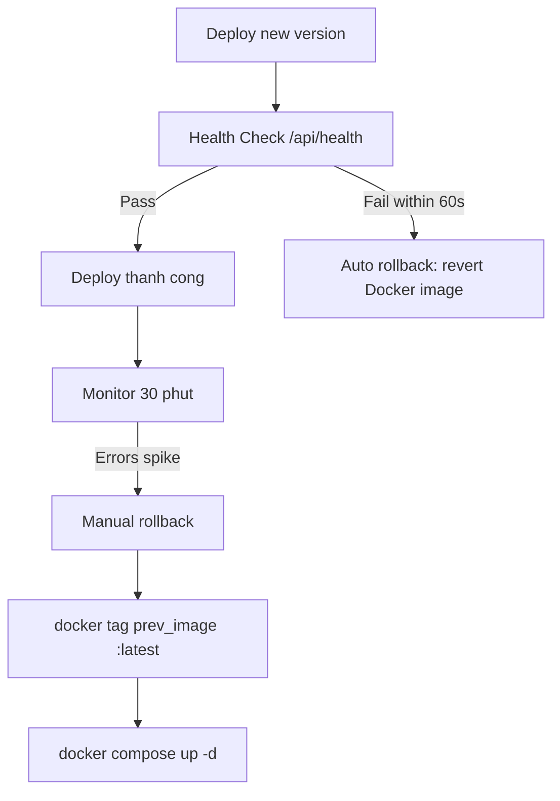

**Backend rollback (da tich hop trong deploy script o tren):**
```bash
# Manual rollback khi can
cd /opt/englearn

# Xem danh sach images cu
docker images englearn-server --format "{{.Tag}} {{.CreatedAt}}"

# Rollback ve image cu the
docker tag englearn-server:<previous-sha> englearn-server:latest
docker compose -f docker-compose.yml -f docker-compose.prod.yml up -d server

# Verify
curl -f http://localhost:5000/api/health
```

**Frontend rollback:**
```bash
docker tag englearn-client:<previous-sha> englearn-client:latest
docker compose -f docker-compose.yml -f docker-compose.prod.yml up -d client nginx
```

**Database rollback:**
- MongoDB Atlas co **Point-in-Time Recovery** (continuous backup)
- Truoc moi migration, chay backup manual: `mongodump --uri="..." --out=backup_$(date +%Y%m%d)`
- KHONG dung destructive migrations (drop collection, remove field) trong production. Chi dung additive changes (add field with default)

### 13.10 Infrastructure Production

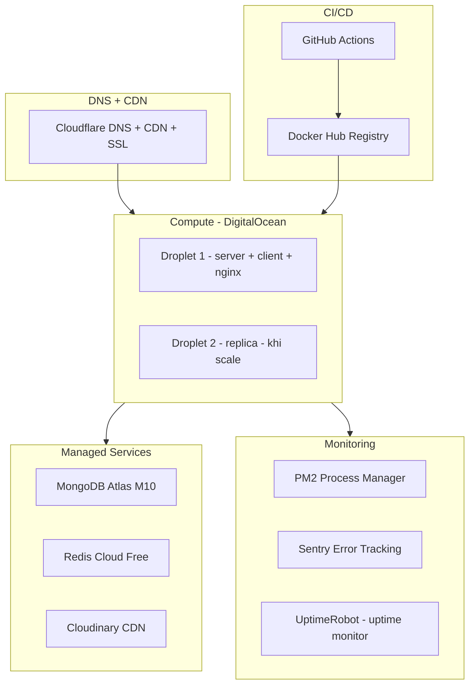

**Cost estimation (MVP):**
- MongoDB Atlas M10: ~$57/month
- DigitalOcean Droplet (2 vCPU, 4GB): ~$24/month
- Redis Cloud (100MB): Free tier
- Cloudinary: Free tier (25GB)
- Docker Hub: Free tier (1 private repo)
- UptimeRobot: Free tier (50 monitors)
- Domain + SSL (Cloudflare): ~$15/year
- **Total MVP: ~$85/month**

---

## 14. UI/UX FLOW

### 14.1 Main Navigation Flow

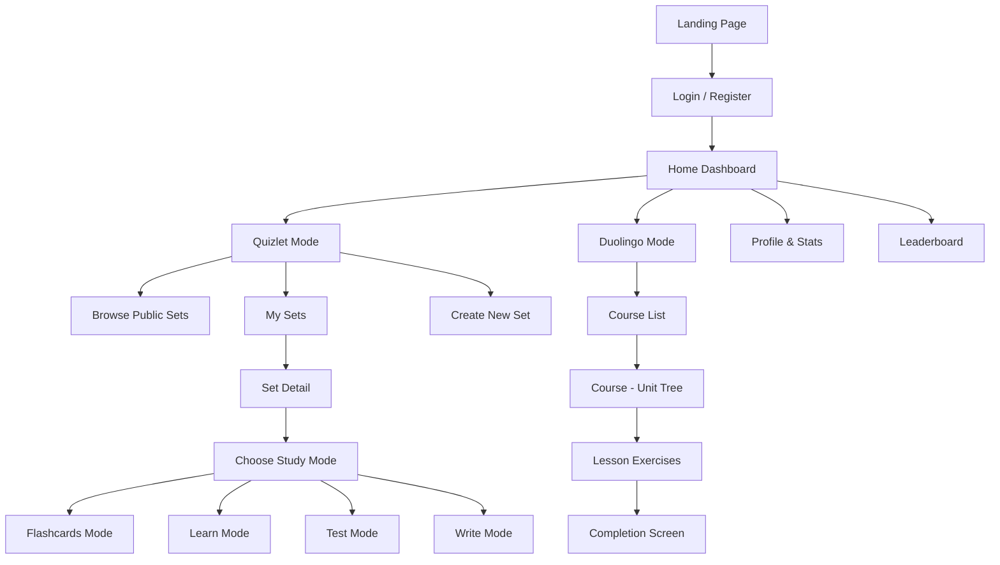

### 14.2 Home Page Layout

```
+----------------------------------------------------------+
|  NAVBAR: Logo | Home | Quizlet | Duolingo | 🔔 | Profile |
+----------------------------------------------------------+
|                                                          |
|  Welcome back, [User]!        Streak: 🔥 7 days         |
|  Daily Goal: ████░░░ 35/50 XP   Level 5 ⭐              |
|                                                          |
+----------------------------+-----------------------------+
|                            |                             |
|   🟢 QUIZLET MODE          |   🟣 DUOLINGO MODE          |
|                            |                             |
|   [Hero Card with          |   [Hero Card with           |
|    illustration]           |    illustration]            |
|                            |                             |
|   "Master vocabulary       |   "Learn English through    |
|    with smart flashcards"  |    structured lessons"      |
|                            |                             |
|   [Start Learning →]       |   [Continue Course →]       |
|                            |                             |
+----------------------------+-----------------------------+
|                                                          |
|  📊 Your Activity This Week                              |
|  [Stats Chart - Sessions, XP, Cards Studied]             |
|                                                          |
+----------------------------------------------------------+
|                                                          |
|  🏆 Daily Quests                                         |
|  ☐ Earn 50 XP today          ████░░ 30/50                |
|  ☐ Complete 3 lessons        ██░░░░ 1/3                  |
|  ☑ Study 20 flashcards       ██████ Done! +15 XP         |
|                                                          |
+----------------------------------------------------------+
```

### 14.3 Android App Architecture (Kotlin)

Android app (MinLish) duoc xay dung bang Kotlin, theo kien truc MVVM + Clean Architecture, chia se cung backend APIs voi web.

#### 14.3.1 Tech Stack Android

- **Language:** Kotlin
- **Architecture:** MVVM + Clean Architecture
- **UI:** Jetpack Compose (modern declarative UI)
- **Navigation:** Jetpack Navigation Compose
- **Networking:** Retrofit 2 + OkHttp + Moshi/Gson
- **Local DB:** Room Database (offline caching)
- **DI:** Hilt (Dagger)
- **Auth:** JWT stored in EncryptedSharedPreferences + Google Sign-In
- **Push Notification:** Firebase Cloud Messaging (FCM)
- **Image Loading:** Coil
- **Charts:** MPAndroidChart / Vico
- **Animations:** Lottie (flip card, streak, XP animations)
- **Work Scheduling:** WorkManager (daily reminders, SRS review scheduler)
- **Testing:** JUnit 5 + MockK + Espresso

#### 14.3.2 Android MVVM Architecture

```mermaid
graph TB
    subgraph presentation [Presentation Layer]
        Screen["Composable Screens"]
        ViewModel["ViewModels"]
        UIState["UI State - StateFlow"]
    end

    subgraph domain [Domain Layer]
        UseCase["Use Cases"]
        DomainModel["Domain Models"]
        RepoInterface["Repository Interfaces"]
    end

    subgraph dataLayer [Data Layer]
        RepoImpl["Repository Implementations"]
        RemoteDS["Remote Data Source - Retrofit"]
        LocalDS["Local Data Source - Room"]
        DTOMapper["DTO Mappers"]
    end

    subgraph external [External]
        BackendAPI["Backend REST API - shared"]
        FCM["Firebase FCM"]
        GoogleAuth["Google Sign-In"]
    end

    Screen --> ViewModel
    ViewModel --> UIState
    ViewModel --> UseCase
    UseCase --> RepoInterface
    RepoInterface -.-> RepoImpl
    RepoImpl --> RemoteDS
    RepoImpl --> LocalDS
    RemoteDS --> DTOMapper
    DTOMapper --> BackendAPI
    LocalDS --> DomainModel
    RepoImpl --> FCM
    RepoImpl --> GoogleAuth
```

#### 14.3.3 Android Project Structure

```
minlish-android/
├── app/
│   ├── src/main/
│   │   ├── java/com/minlish/app/
│   │   │   │
│   │   │   ├── di/                          # Hilt DI modules
│   │   │   │   ├── AppModule.kt
│   │   │   │   ├── NetworkModule.kt         # Retrofit, OkHttp providers
│   │   │   │   ├── DatabaseModule.kt        # Room providers
│   │   │   │   └── RepositoryModule.kt      # Bind repo interfaces
│   │   │   │
│   │   │   ├── data/                        # DATA LAYER
│   │   │   │   ├── remote/
│   │   │   │   │   ├── api/
│   │   │   │   │   │   ├── AuthApi.kt       # Retrofit interface: login, register
│   │   │   │   │   │   ├── VocabularyApi.kt # Retrofit: flashcard sets, cards
│   │   │   │   │   │   ├── StudyApi.kt      # Retrofit: study sessions, SRS
│   │   │   │   │   │   ├── GamificationApi.kt # Retrofit: XP, streak, leaderboard
│   │   │   │   │   │   └── CourseApi.kt     # Retrofit: Duolingo courses, lessons
│   │   │   │   │   ├── dto/
│   │   │   │   │   │   ├── AuthDto.kt       # Login/Register request/response
│   │   │   │   │   │   ├── VocabularyDto.kt
│   │   │   │   │   │   ├── StudyDto.kt
│   │   │   │   │   │   └── GamificationDto.kt
│   │   │   │   │   ├── interceptor/
│   │   │   │   │   │   ├── AuthInterceptor.kt    # Inject JWT header
│   │   │   │   │   │   └── TokenRefreshAuth.kt   # Auto refresh expired tokens
│   │   │   │   │   └── ApiResult.kt         # Sealed class: Success/Error/Loading
│   │   │   │   │
│   │   │   │   ├── local/
│   │   │   │   │   ├── db/
│   │   │   │   │   │   ├── MinLishDatabase.kt  # Room database
│   │   │   │   │   │   ├── dao/
│   │   │   │   │   │   │   ├── VocabularyDao.kt
│   │   │   │   │   │   │   ├── StudySessionDao.kt
│   │   │   │   │   │   │   └── ProgressDao.kt
│   │   │   │   │   │   └── entity/
│   │   │   │   │   │       ├── WordSetEntity.kt
│   │   │   │   │   │       ├── WordEntity.kt
│   │   │   │   │   │       └── ProgressEntity.kt
│   │   │   │   │   └── prefs/
│   │   │   │   │       └── TokenManager.kt   # EncryptedSharedPreferences
│   │   │   │   │
│   │   │   │   ├── repository/              # Repository implementations
│   │   │   │   │   ├── AuthRepositoryImpl.kt
│   │   │   │   │   ├── VocabularyRepositoryImpl.kt
│   │   │   │   │   ├── StudyRepositoryImpl.kt
│   │   │   │   │   ├── GamificationRepositoryImpl.kt
│   │   │   │   │   └── CourseRepositoryImpl.kt
│   │   │   │   │
│   │   │   │   └── mapper/                  # DTO <-> Domain mappers
│   │   │   │       ├── VocabularyMapper.kt
│   │   │   │       └── StudyMapper.kt
│   │   │   │
│   │   │   ├── domain/                      # DOMAIN LAYER
│   │   │   │   ├── model/
│   │   │   │   │   ├── User.kt
│   │   │   │   │   ├── WordSet.kt
│   │   │   │   │   ├── Word.kt              # word, pronunciation, meaning,
│   │   │   │   │   │                        # description, example, collocation,
│   │   │   │   │   │                        # relatedWords, note
│   │   │   │   │   ├── StudySession.kt
│   │   │   │   │   ├── ReviewCard.kt        # SRS card state
│   │   │   │   │   ├── Course.kt
│   │   │   │   │   ├── Lesson.kt
│   │   │   │   │   ├── Progress.kt
│   │   │   │   │   └── GamificationProfile.kt
│   │   │   │   │
│   │   │   │   ├── repository/              # Repository interfaces
│   │   │   │   │   ├── AuthRepository.kt
│   │   │   │   │   ├── VocabularyRepository.kt
│   │   │   │   │   ├── StudyRepository.kt
│   │   │   │   │   ├── GamificationRepository.kt
│   │   │   │   │   └── CourseRepository.kt
│   │   │   │   │
│   │   │   │   └── usecase/
│   │   │   │       ├── auth/
│   │   │   │       │   ├── LoginUseCase.kt
│   │   │   │       │   ├── RegisterUseCase.kt
│   │   │   │       │   └── GoogleSignInUseCase.kt
│   │   │   │       ├── vocabulary/
│   │   │   │       │   ├── GetWordSetsUseCase.kt
│   │   │   │       │   ├── CreateWordSetUseCase.kt
│   │   │   │       │   ├── AddWordUseCase.kt
│   │   │   │       │   └── ImportWordsUseCase.kt
│   │   │   │       ├── study/
│   │   │   │       │   ├── StartFlashcardSessionUseCase.kt
│   │   │   │       │   ├── SubmitReviewUseCase.kt  # SM-2 quality rating
│   │   │   │       │   ├── GetDueCardsUseCase.kt
│   │   │   │       │   └── GetDailyPlanUseCase.kt
│   │   │   │       └── progress/
│   │   │   │           ├── GetDashboardUseCase.kt
│   │   │   │           └── GetStreakUseCase.kt
│   │   │   │
│   │   │   ├── presentation/               # PRESENTATION LAYER
│   │   │   │   ├── navigation/
│   │   │   │   │   ├── AppNavGraph.kt
│   │   │   │   │   ├── Screen.kt           # Sealed class for routes
│   │   │   │   │   └── BottomNavBar.kt
│   │   │   │   │
│   │   │   │   ├── theme/
│   │   │   │   │   ├── Theme.kt
│   │   │   │   │   ├── Color.kt
│   │   │   │   │   ├── Typography.kt
│   │   │   │   │   └── Shape.kt
│   │   │   │   │
│   │   │   │   ├── auth/
│   │   │   │   │   ├── LoginScreen.kt
│   │   │   │   │   ├── RegisterScreen.kt
│   │   │   │   │   └── AuthViewModel.kt
│   │   │   │   │
│   │   │   │   ├── home/
│   │   │   │   │   ├── HomeScreen.kt        # Dashboard: streak, daily plan, stats
│   │   │   │   │   └── HomeViewModel.kt
│   │   │   │   │
│   │   │   │   ├── vocabulary/
│   │   │   │   │   ├── WordSetListScreen.kt
│   │   │   │   │   ├── WordSetDetailScreen.kt
│   │   │   │   │   ├── CreateWordSetScreen.kt
│   │   │   │   │   ├── AddWordScreen.kt
│   │   │   │   │   ├── ImportScreen.kt
│   │   │   │   │   └── VocabularyViewModel.kt
│   │   │   │   │
│   │   │   │   ├── study/
│   │   │   │   │   ├── FlashcardScreen.kt   # Flip animation, swipe cards
│   │   │   │   │   ├── ReviewScreen.kt      # SRS: Again/Hard/Good/Easy buttons
│   │   │   │   │   ├── PracticeScreen.kt    # Multiple choice, typing, matching
│   │   │   │   │   ├── SessionResultScreen.kt
│   │   │   │   │   └── StudyViewModel.kt
│   │   │   │   │
│   │   │   │   ├── progress/
│   │   │   │   │   ├── DashboardScreen.kt   # Words learned, streak, accuracy
│   │   │   │   │   ├── ChartScreen.kt       # Daily activity, retention rate
│   │   │   │   │   └── ProgressViewModel.kt
│   │   │   │   │
│   │   │   │   ├── profile/
│   │   │   │   │   ├── ProfileScreen.kt
│   │   │   │   │   ├── SettingsScreen.kt
│   │   │   │   │   └── ProfileViewModel.kt
│   │   │   │   │
│   │   │   │   └── components/              # Shared Composables
│   │   │   │       ├── FlashcardView.kt     # Reusable flip card
│   │   │   │       ├── StreakBadge.kt
│   │   │   │       ├── XPProgressBar.kt
│   │   │   │       ├── LoadingOverlay.kt
│   │   │   │       ├── ErrorDialog.kt
│   │   │   │       └── EmptyState.kt
│   │   │   │
│   │   │   ├── worker/                      # WorkManager jobs
│   │   │   │   ├── DailyReminderWorker.kt   # Push daily study reminder
│   │   │   │   ├── SyncWorker.kt            # Sync offline data when online
│   │   │   │   └── ReviewScheduleWorker.kt  # Check due cards, send notification
│   │   │   │
│   │   │   └── MinLishApplication.kt        # Hilt Application class
│   │   │
│   │   └── res/
│   │       ├── values/
│   │       │   ├── strings.xml
│   │       │   ├── colors.xml
│   │       │   └── themes.xml
│   │       ├── drawable/
│   │       ├── raw/                         # Lottie animation files
│   │       └── font/
│   │
│   ├── src/test/                            # Unit tests
│   │   ├── viewmodel/
│   │   └── usecase/
│   │
│   └── src/androidTest/                     # Instrumented tests
│       └── ui/
│
├── build.gradle.kts                         # Project-level
├── app/build.gradle.kts                     # App-level dependencies
├── gradle.properties
└── settings.gradle.kts
```

#### 14.3.4 Android App Key Screens

```mermaid
graph TB
    Splash["Splash Screen"] --> Onboard["Onboarding - first time"]
    Onboard --> Auth["Login / Register"]
    Auth --> Main["Main - Bottom Navigation"]

    Main --> Home["Home Tab - Dashboard"]
    Main --> Vocab["Vocabulary Tab"]
    Main --> Study["Study Tab"]
    Main --> Progress["Progress Tab"]
    Main --> Profile["Profile Tab"]

    Home --> DailyPlan["Daily Plan: N new + M review"]
    Home --> QuickStudy["Quick Study - due cards"]

    Vocab --> SetList["Word Set List"]
    SetList --> SetDetail["Set Detail - word list"]
    SetDetail --> AddWord["Add Word Form"]
    SetList --> CreateSet["Create New Set"]
    SetList --> ImportSet["Import CSV/Excel"]

    Study --> FlashcardMode["Flashcard Mode - flip cards"]
    Study --> ReviewMode["SRS Review - Again/Hard/Good/Easy"]
    Study --> PracticeMode["Practice - MC/Typing/Matching"]
    FlashcardMode --> Result["Session Result"]
    ReviewMode --> Result
    PracticeMode --> Result

    Progress --> Dashboard["Stats: words, streak, accuracy"]
    Progress --> Charts["Charts: activity, retention"]
    Progress --> LevelEst["Level Estimation A1-C2"]
```

#### 14.3.5 Android SM-2 Implementation (Kotlin)

```kotlin
data class ReviewCard(
    val cardId: String,
    var easeFactor: Double = 2.5,
    var interval: Int = 0,        // days
    var repetitions: Int = 0,
    var nextReviewAt: Long = 0    // timestamp
)

enum class ReviewQuality(val value: Int) {
    AGAIN(0), HARD(2), GOOD(3), EASY(5)
}

fun calculateNextReview(card: ReviewCard, quality: ReviewQuality): ReviewCard {
    val q = quality.value
    var ef = card.easeFactor
    var interval = card.interval
    var reps = card.repetitions

    if (q >= 3) {
        interval = when (reps) {
            0 -> 1
            1 -> 6
            else -> (interval * ef).roundToInt()
        }
        reps++
    } else {
        reps = 0
        interval = 1
    }

    ef = maxOf(1.3, ef + (0.1 - (5 - q) * (0.08 + (5 - q) * 0.02)))

    val nextReview = System.currentTimeMillis() + interval * 24 * 60 * 60 * 1000L

    return card.copy(
        easeFactor = ef,
        interval = interval,
        repetitions = reps,
        nextReviewAt = nextReview
    )
}
```

#### 14.3.6 Android Word Domain Model

```kotlin
data class Word(
    val id: String,
    val setId: String,
    val word: String,
    val pronunciation: String,     // IPA: /ˈwɜːrkɪŋ/
    val meaning: String,           // Vietnamese meaning
    val description: String,       // English definition
    val example: String,           // Example sentence
    val collocation: List<String>, // ["make progress", "hard work"]
    val relatedWords: List<String>,// ["working", "worker", "workplace"]
    val note: String,              // Personal notes
    val audioUrl: String?,
    val imageUrl: String?,
    val difficulty: Double = 0.3,
    val createdAt: Long,
    val updatedAt: Long
)
```

#### 14.3.7 Shared Backend API (Web + Android cung dung)

Ca web (React) va Android (Kotlin/Retrofit) deu goi chung cac REST API endpoints da thiet ke o Section 8. Android su dung Retrofit interface mapping 1:1 voi backend routes:

```kotlin
interface VocabularyApi {
    @GET("api/flashcard-sets")
    suspend fun getSets(
        @Query("page") page: Int,
        @Query("limit") limit: Int,
        @Query("search") search: String?
    ): ApiResponse<PaginatedResult<WordSetDto>>

    @POST("api/flashcard-sets")
    suspend fun createSet(@Body body: CreateSetRequest): ApiResponse<WordSetDto>

    @GET("api/flashcard-sets/{id}/cards")
    suspend fun getCards(@Path("id") setId: String): ApiResponse<List<WordDto>>

    @POST("api/flashcard-sets/{id}/cards")
    suspend fun addCard(@Path("id") setId: String, @Body body: AddWordRequest): ApiResponse<WordDto>

    @POST("api/flashcard-sets/import")
    suspend fun importFromFile(@Body file: MultipartBody.Part): ApiResponse<WordSetDto>
}

interface StudyApi {
    @POST("api/study/sessions")
    suspend fun startSession(@Body body: StartSessionRequest): ApiResponse<StudySessionDto>

    @POST("api/study/sessions/{id}/answer")
    suspend fun submitAnswer(@Path("id") sessionId: String, @Body body: AnswerRequest): ApiResponse<AnswerResultDto>

    @GET("api/study/review-cards")
    suspend fun getDueCards(): ApiResponse<List<ReviewCardDto>>
}
```

---

## 15. MVP FEATURES -- PHAN CHIA WEB vs ANDROID

### 15.1 Web MVP (7 weeks -- Full Quizlet + Duolingo)

**Quizlet Mode:**
- Tao/sua/xoa flashcard sets
- Flashcards mode (flip, shuffle)
- Learn mode (multiple choice)
- Test mode (basic)
- Write mode
- Public/private sets
- Browse & search public sets
- Import flashcards (Excel/CSV)
- Share flashcard sets

**Duolingo Mode:**
- 1 course with 3 units, 5 lessons each
- Multiple choice, Fill-in-blank, Typing, Matching, Word bank exercises
- Lesson completion + XP rewards
- Unit unlock progression

**Core Web:**
- Registration + Login (email + Google)
- User profile + preferences
- XP + Streak + Level system
- Leaderboard + League
- Achievement + Daily quests
- Notifications
- AI Chat (Q-Chat) basic
- Premium subscription (Stripe)
- Responsive design

### 15.2 Android MVP (7 weeks -- MinLish Vocabulary App)

**User Management:**
- Dang ky / Dang nhap (email + Google Sign-In)
- Profile: ten, muc tieu hoc (IELTS, giao tiep...), level A1-C2
- JWT auth voi EncryptedSharedPreferences

**Vocabulary Management:**
- Tao bo tu vung (ten, mo ta, tags)
- Them tu: word, pronunciation, meaning, description, example, collocation, related words, note
- Import CSV/Excel
- Export bo tu

**Learning Module:**
- Flashcard mode: front (word) / back (meaning + example), flip animation (Lottie)
- Spaced Repetition SM-2: Again / Hard / Good / Easy
- Daily learning plan: so tu moi + so tu can on

**Practice Module:**
- Multiple choice
- Typing answer
- Matching

**Progress Tracking:**
- Dashboard: so tu da hoc, streak, accuracy %
- Bieu do: daily activity, retention rate (MPAndroidChart)
- Level estimation: Beginner / Intermediate / Advanced

**Notification System:**
- Nhac hoc moi ngay (WorkManager)
- Nhac tu den han on (SRS scheduler)
- Push notification (Firebase FCM)

**Offline Support:**
- Room database cache bo tu va progress
- SyncWorker dong bo khi co mang

---

## 16. CHIA TASK CHO TEAM 3 NGUOI (7 TUAN SONG SONG)

### Team Roles

- **Dev A (Backend Lead):** Backend APIs (NodeJS/Express/MongoDB), database, auth, gamification logic, AI, payment, DevOps. Xay dung APIs dung chung cho ca Web va Android.
- **Dev B (Web Frontend):** React web app, Bootstrap UI, tat ca web pages, responsive design, state management. Tieu thu APIs cua Dev A.
- **Dev C (Android Developer):** Kotlin Android app (MinLish), MVVM + Compose, Retrofit, Room, Firebase. Tieu thu APIs cua Dev A.

### Nguyen tac phoi hop

- Dev A xay APIs truoc 1-2 ngay de Dev B + Dev C co endpoint test
- Dung Postman collection chia se, Swagger docs
- Daily standup 15 phut moi sang
- Git branching: `main` -> `develop` -> `feature/web-*`, `feature/android-*`, `feature/api-*`
- APIs deploy len staging server som nhat co the (end of week 1)

---

## 17. ROADMAP 7 TUAN SONG SONG (WEB + ANDROID)

### WEEK 1: Foundation

| Dev A (Backend) | Dev B (Web) | Dev C (Android) |
|---|---|---|
| Express project setup, env config | React + Vite + Bootstrap setup | Android project setup, Hilt DI |
| MongoDB connection, Redis setup | React Router, layout (Navbar, Sidebar, Footer) | Network module: Retrofit, OkHttp, Interceptors |
| User model + Auth APIs (register, login, JWT, refresh, Google OAuth) | Auth pages: Login, Register, Forgot PW | Room database setup, entity classes |
| Middleware: auth, error, validation, rate limiter | AuthContext, ProtectedRoute, token interceptor | Auth screens: Login, Register (Compose) |
| FlashcardSet + Flashcard + Tag models | Home page skeleton | Google Sign-In integration |
| Course, Unit, Lesson, Exercise models | -- | Token manager (EncryptedSharedPreferences) |
| Folder, Note, MistakeLog models | -- | Bottom navigation + screen routes |
| UserProgress, Achievement, LearningPreferences models | -- | -- |
| DailyQuest, LeaderboardEntry, LearningHistory, Notification models | -- | -- |
| Deploy staging API (Docker on VPS) | -- | -- |

**Milestone Week 1:** Auth API working. Web + Android can register/login. Staging API deployed.

### WEEK 2: Quizlet Core + Vocabulary

| Dev A (Backend) | Dev B (Web) | Dev C (Android) |
|---|---|---|
| Flashcard Set CRUD APIs | Create/Edit Flashcard Set page | Word Set list screen |
| Flashcard CRUD APIs (add, edit, delete, bulk, reorder) | FlashcardViewer component (flip, shuffle) | Create Word Set screen |
| Tag CRUD APIs + search/filter by tag | SetDetail page (card list, edit cards) | Add Word form (all fields: word, pronunciation, meaning, description, example, collocation, related, note) |
| Folder CRUD APIs + organize sets into folders | Browse/Search public sets page (filter by tags) | Word Set detail screen (word list) |
| Import service (Excel/CSV parser) | Import modal (file upload) | VocabularyViewModel + Repository |
| Share + bookmark APIs | Folder management UI, Tag picker | Room DAO for offline word storage |
| Study Session APIs (start, answer, complete) | Share modal, bookmark toggle | Sync logic (online/offline) |
| Note CRUD APIs (create notes, link to flashcards) | My Sets page + Folder view | -- |

**Milestone Week 2:** Full flashcard CRUD on web + Android. Import CSV working. Search/browse functional.

### WEEK 3: Study Modes + Flashcard Learning

| Dev A (Backend) | Dev B (Web) | Dev C (Android) |
|---|---|---|
| Learn mode logic (adaptive quiz generation) | Flashcards study mode UI | Flashcard screen (flip animation, Lottie) |
| Test mode logic (MC, T/F, typing, scoring) | Learn mode UI (quiz flow, feedback) | SRS Review screen: Again/Hard/Good/Easy buttons |
| Write mode logic | Test mode UI (timer, scoring, results) | SM-2 algorithm implementation (Kotlin) |
| Spaced repetition engine (SM-2) | Write mode UI (typing answer) | StudyViewModel + session tracking |
| Review cards API (get due cards, update schedule) | Study results/summary page | Get due cards from API + local Room |
| Match mode logic | Progress bar, session timer components | Daily learning plan screen (new + review count) |
| -- | -- | Import CSV/Excel (file picker + parser) |

**Milestone Week 3:** All study modes playable on web. Android flashcard + SRS review working. SM-2 functional.

### WEEK 4: Duolingo Mode + Practice

| Dev A (Backend) | Dev B (Web) | Dev C (Android) |
|---|---|---|
| Course/Unit/Lesson/Exercise CRUD APIs | Duolingo home page (course list) | Practice screen: Multiple choice |
| Exercise validation + scoring | Course detail page (unit tree, lesson bubbles) | Practice screen: Typing answer |
| Lesson start/complete APIs | Lesson page (exercise renderer) | Practice screen: Matching pairs |
| Exercise types: MC, Fill-blank, Typing, Matching, Word bank, Translation | ExerciseRenderer components (all types) | Practice session result screen |
| Course progress APIs | Lesson completion screen (XP animation) | Export word set (CSV) |
| Course seeder data (3 units, 15 lessons, 100+ exercises) | -- | PracticeViewModel |
| -- | -- | Session result syncing to backend |

**Milestone Week 4:** Duolingo mode fully playable on web. Android practice modes working. Course content seeded.

### WEEK 5: Gamification + Progress

| Dev A (Backend) | Dev B (Web) | Dev C (Android) |
|---|---|---|
| UserProgress APIs (totalXP, currentStreak, skillLevels) | XP bar, level badge components | Dashboard screen (words learned, streak, accuracy) |
| Streak service (daily check, freeze, reset cron job) | Streak counter component | Charts: daily activity, retention rate (MPAndroidChart) |
| LeaderboardEntry APIs + Redis caching | Leaderboard page (weekly, by league) | Level estimation display (A1-C2) |
| Achievement + UserAchievement check engine | Achievement page, badge cards | Streak badge + XP progress bar components |
| DailyQuest generator (cron job) | DailyQuest widget on home page | ProgressViewModel + local caching |
| League system (promote/demote logic) | League display | Home screen dashboard (daily plan + stats) |
| LearningHistory logging service | LearningHistory chart components | -- |
| MistakeLog APIs (weak skill review) | Mistake review page | -- |
| Notification APIs + FCM backend | Notification dropdown component | -- |

**Milestone Week 5:** Gamification fully working on web. Android dashboard + charts complete. Leaderboard live.

### WEEK 6: AI + Premium + Notifications

| Dev A (Backend) | Dev B (Web) | Dev C (Android) |
|---|---|---|
| OpenAI integration (Q-Chat API) | AI Chat UI (ChatBot component) | Push notifications (FCM integration) |
| Recommendation API | Recommendations widget | Daily reminder (WorkManager) |
| Stripe payment integration | Premium page + checkout flow | Review schedule notifications |
| Subscription webhook handler | Profile page (stats charts, LearningHistory) | Settings screen (LearningPreferences: reminder, goals, level) |
| Notification cron jobs (reminders) | Settings page (LearningPreferences UI) | Profile screen |
| Premium middleware (feature gating) | Admin panel (basic course management) | Offline mode polish (Room sync) |

**Milestone Week 6:** AI chat working on web. Premium flow complete. Android notifications + full offline support.

### WEEK 7: Testing + Deploy + Release

| Dev A (Backend) | Dev B (Web) | Dev C (Android) |
|---|---|---|
| Docker production setup | Cross-browser testing (Chrome, Firefox, Safari, Edge) | UI polish, animations, edge cases |
| CI/CD pipeline (GitHub Actions) | Responsive testing (mobile, tablet, desktop) | Unit tests (ViewModel, UseCase) |
| MongoDB Atlas production migration | Performance: lazy loading, code splitting | Instrumented tests (Espresso) |
| PM2 + Sentry monitoring | Bug fixes, final UI polish | ProGuard/R8 optimization |
| Load testing (1k concurrent) | SEO basics (meta tags, sitemap) | Generate signed APK / AAB |
| SSL, CORS, security hardening | Documentation (README, API docs) | Play Store listing preparation |
| DNS + Cloudflare CDN setup | -- | Internal testing distribution (Firebase App Distribution) |
| Backup strategy (MongoDB scheduled backups) | -- | -- |

**Milestone Week 7:** Web deployed to production. Android APK ready for distribution/Play Store.

### Key Milestones Summary

| Week | Milestone | Web Status | Android Status |
|---|---|---|---|
| 1 | Auth working | Login/Register done | Login/Register done |
| 2 | Content CRUD | Flashcard sets full CRUD | Word sets + words CRUD |
| 3 | Study modes | Learn/Test/Write/Match modes | Flashcard flip + SRS review |
| 4 | Duolingo + Practice | Duolingo mode playable | Practice modes (MC/Typing/Match) |
| 5 | Gamification | XP/Streak/Leaderboard live | Dashboard + Charts + Level |
| 6 | AI + Premium + Notif | AI Chat + Stripe + Notif | FCM + Reminders + Offline |
| 7 | **RELEASE** | **Production deploy** | **APK/AAB ready** |

### Risk Mitigation

- **Backend la bottleneck:** Dev A phai deliver APIs truoc Dev B + Dev C it nhat 1-2 ngay. Neu cham, Dev B/Dev C dung mock data / MSW (Mock Service Worker) de khong bi block.
- **7 tuan la tight:** Cut scope neu can. Priority: Auth > Flashcard CRUD > Study modes > Gamification > AI/Premium. AI Chat va Premium co the defer post-launch.
- **Android scope nho hon Web:** Day la dung y do. Android focus vao vocabulary + SRS (MinLish core), khong can full Duolingo mode. Web lam full ca 2 mode.
- **Testing time:** Moi dev tu test feature cua minh suot qua trinh, week 7 chi la integration testing + polish, khong phai bat dau test tu dau.

---

## 18. SCALABLE ARCHITECTURE NOTES

### Horizontal Scaling Strategy

(Chi tiet migration roadmap xem Section 2: Migration Roadmap: Monolith -> Microservices)

1. **Phase 1 (0-1K users):** Single server DigitalOcean, MongoDB Atlas M10, Redis free tier, Docker Compose deployment
2. **Phase 2 (1K-5K users):** Add Redis caching (paid tier), CDN for media, MongoDB M20 + Replica Set, Load balancer (NGINX)
3. **Phase 3 (5K-50K users):** Tach Gamification + Study thanh microservices rieng, API Gateway (Kong/NGINX), Redis Pub/Sub event bus, DB per service
4. **Phase 4 (50K+ users):** Full microservices, Kubernetes (DigitalOcean K8s), RabbitMQ message queue, MongoDB sharding, dedicated AI service (GPU server)

### Performance Optimizations

- **Redis caching:** Leaderboard (1 min TTL), popular flashcard sets (1 hour TTL), user session data
- **Database indexes:** Compound indexes cho mọi frequent query pattern
- **Pagination:** Cursor-based pagination cho infinite scroll
- **Lazy loading:** Code splitting React components, image lazy load
- **CDN:** Cloudflare cho static assets, media files
- **Connection pooling:** Mongoose connection pool size tuning
- **Background jobs:** Bull queue cho heavy operations (import files, AI generation, email sending)

### Clean Architecture + MVC + SOLID Principles Applied

- **MVC Separation:** View (React) -> Controller (Express) -> Service -> Model (Mongoose) -- moi tang chi lam 1 viec
- **Single Responsibility (S):** Controller chi lo req/res, Service chi lo business logic, Model chi lo data shape
- **Open/Closed (O):** Event-driven gamification cho phep them achievement moi khong sua code cu. Exercise types dung Strategy pattern -- them type moi chi can them 1 validator class
- **Liskov Substitution (L):** Tat ca Services ke thua BaseService voi interface chung (create, findById, update, delete). Co the swap implementation ma khong anh huong Controller
- **Interface Segregation (I):** Validation tach rieng (Joi), middleware tach rieng, error handling tach rieng. Controller khong phu thuoc vao validation logic
- **Dependency Inversion (D):** Controller phu thuoc vao Service interface, khong phu thuoc vao Model truc tiep. Service nhan dependencies qua constructor (de mock khi testing)

**MVC Data Flow Rule:**
```
Request -> Router -> Middleware -> Controller -> Service -> Model -> MongoDB
                                                                      |
Response <- Controller <- Service <-----------------------------------+
```
Controller KHONG DUOC goi Model. Service KHONG DUOC truy cap req/res. Model KHONG DUOC chua business logic.
